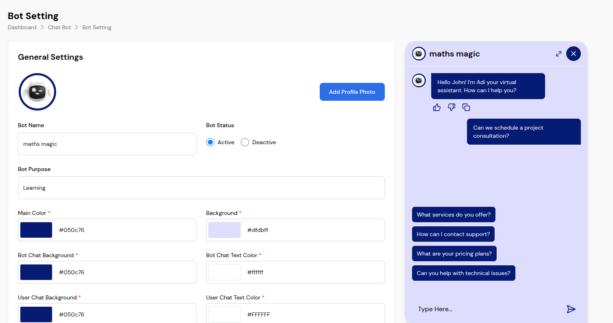
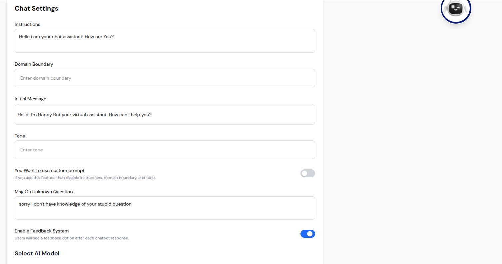
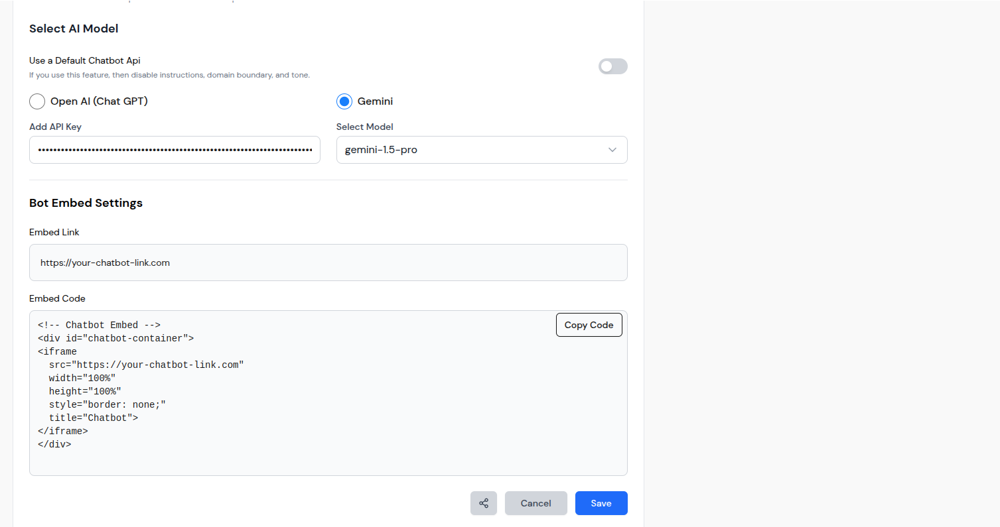
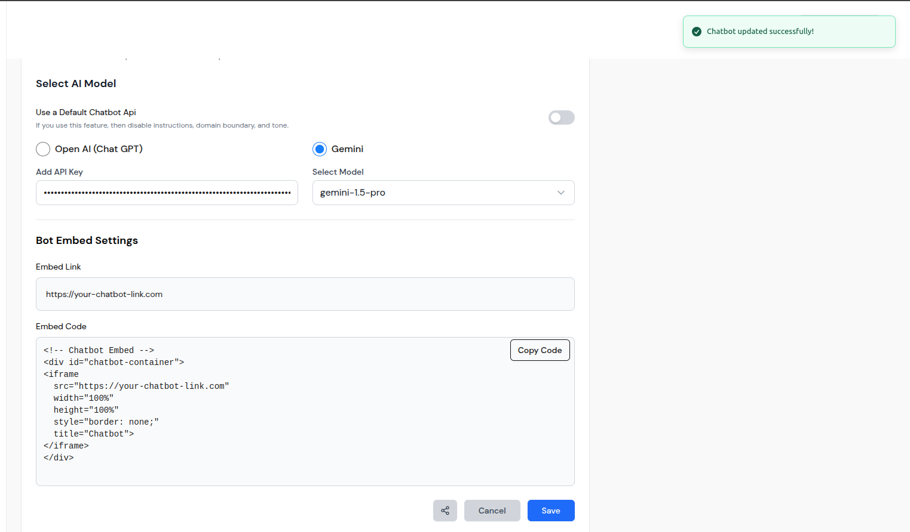

# Bot Settings Setup Guide

This comprehensive guide will help you set up and configure the Bot Settings system for your AI chat bot. Learn how to customize your chatbot's appearance, behavior, and functionality to match your brand and requirements.

## Prerequisites

Before setting up the Bot Settings system, ensure you have:
- ✅ Admin panel access with proper permissions
- ✅ AI chat bot system configured and running
- ✅ API keys for chosen AI model (OpenAI or Gemini)
- ✅ Basic understanding of chatbot configuration

## Step 1: Access Bot Settings

### Navigate to Bot Settings
1. **Login** to your admin panel
2. **Navigate** to Dashboard > Chat Bot > Bot Setting
3. **View** the split-screen interface with settings and preview
4. **Familiarize** yourself with the configuration options

### Interface Overview
The Bot Settings interface includes:
- **Left Panel**: Configuration settings and options
- **Right Panel**: Live chatbot preview
- **Real-time Updates**: Changes reflect immediately in preview
- **Modern Design**: Clean, professional interface

## Step 2: Configure General Settings

### Bot Profile Setup
1. **Set Bot Name**: Enter a descriptive name (e.g., "maths magic")
2. **Upload Profile Photo**: Click "Add Profile Photo" to upload custom image
3. **Set Bot Status**: Choose "Active" or "Deactive" status
4. **Define Bot Purpose**: Enter bot purpose (e.g., "Learning")
5. **Use Live Preview**: Check how changes appear in the preview panel

### Color Customization
1. **Main Color**: Set primary color for interface elements
2. **Background Color**: Choose chat background color
3. **Bot Chat Colors**: Configure bot message background and text colors
4. **User Chat Colors**: Configure user message background and text colors
5. **Test Colors**: Use live preview to test color combinations

## Step 3: Configure Chat Settings

### Bot Behavior Setup
1. **Set Instructions**: Enter custom instructions for bot behavior
2. **Define Domain Boundary**: Set knowledge boundaries for bot expertise
3. **Configure Initial Message**: Set welcome message for users
4. **Set Tone**: Define communication style and personality
5. **Test Behavior**: Use live preview to test bot responses

### Advanced Settings
1. **Custom Prompt**: Enable/disable custom prompt feature
2. **Unknown Question Handling**: Set fallback message for unknown queries
3. **Feedback System**: Enable/disable user feedback system
4. **Test Settings**: Verify all settings work as expected

## Step 4: Configure AI Model

### Model Selection
1. **Choose AI Provider**: Select between OpenAI (Chat GPT) or Gemini
2. **Enter API Key**: Securely enter your API key
3. **Select Model Version**: Choose specific model (e.g., "gemini-1.5-pro")
4. **Test Configuration**: Verify API connection and model response
5. **Monitor Performance**: Check response quality and speed

### API Configuration
1. **Secure API Keys**: Keep API keys secure and updated
2. **Model Compatibility**: Ensure chosen model works with your use case
3. **Cost Management**: Monitor API usage and costs
4. **Backup Options**: Have alternative models ready
5. **Performance Monitoring**: Track response times and accuracy

## Step 5: Configure Embed Settings

### Website Integration
1. **Set Embed Link**: Configure chatbot embed URL
2. **Generate Embed Code**: Copy HTML code for website integration
3. **Test Embed Code**: Verify embed code works on your website
4. **Responsive Design**: Ensure chatbot works on all devices
5. **Performance**: Monitor chatbot performance on your site

### Embed Code Implementation
1. **Copy Code**: Use "Copy Code" button to copy embed code
2. **Website Integration**: Add code to your website
3. **Test Functionality**: Verify chatbot works on your site
4. **Custom Domain**: Configure custom domain if needed
5. **Analytics**: Track chatbot usage and effectiveness

## Step 6: Test and Validate

### Configuration Testing
1. **Test All Settings**: Verify all configurations work properly
2. **Color Testing**: Ensure colors work well together
3. **Behavior Testing**: Test bot responses and behavior
4. **Integration Testing**: Verify embed code works on website
5. **Performance Testing**: Check response times and quality

### User Experience Testing
1. **Preview Interface**: Use live preview to test user experience
2. **Message Flow**: Test conversation flow and responses
3. **Quick Replies**: Test suggested questions and responses
4. **Mobile Testing**: Ensure chatbot works on mobile devices
5. **Accessibility**: Verify chatbot meets accessibility standards

## Best Practices for Setup

### Configuration Management
1. **Test Settings**: Use live preview to test all configurations
2. **Color Coordination**: Ensure colors work well together
3. **Brand Alignment**: Align bot personality with brand voice
4. **User Experience**: Consider user experience in all settings
5. **Regular Updates**: Keep bot settings current and relevant

### AI Model Selection
1. **API Compatibility**: Ensure chosen model works with your use case
2. **Performance**: Consider response time and accuracy
3. **Cost Management**: Monitor API usage and costs
4. **Security**: Keep API keys secure and updated
5. **Backup Options**: Have alternative models ready

### Embed Integration
1. **Website Compatibility**: Test embed code on your website
2. **Responsive Design**: Ensure chatbot works on all devices
3. **Performance**: Monitor chatbot performance on your site
4. **User Experience**: Ensure smooth integration with your site
5. **Analytics**: Track chatbot usage and effectiveness

## Advanced Configuration

### Custom Prompt Setup
1. **Enable Custom Prompt**: Toggle custom prompt feature
2. **Disable Other Settings**: Turn off instructions, domain boundary, and tone
3. **Write Custom Prompt**: Create comprehensive custom prompt
4. **Test Custom Prompt**: Verify custom prompt works as expected
5. **Monitor Performance**: Track custom prompt effectiveness

### Advanced Color Management
1. **Hex Code Input**: Use direct hexadecimal color codes
2. **Color Testing**: Test colors in different lighting conditions
3. **Accessibility**: Ensure colors meet accessibility standards
4. **Brand Consistency**: Align colors with brand guidelines
5. **User Testing**: Test colors with real users

### Performance Optimization
1. **API Optimization**: Optimize API calls and responses
2. **Caching**: Implement caching for better performance
3. **Monitoring**: Monitor chatbot performance and usage
4. **Scaling**: Plan for increased usage and traffic
5. **Backup**: Keep backup configurations for different scenarios

## Troubleshooting Setup Issues

### Common Problems
- **Preview Not Updating**: Check if changes are saved properly
- **Color Not Applying**: Verify color codes are valid
- **API Errors**: Check API key validity and model selection
- **Embed Issues**: Verify embed code and URL configuration

### Solutions
1. **Refresh Interface**: Reload page to resolve temporary issues
2. **Check Configuration**: Verify all settings are properly configured
3. **Test API Keys**: Ensure API keys are valid and active
4. **Contact Support**: Contact support for persistent issues

### Performance Issues
- **Slow Responses**: Check API configuration and model selection
- **Color Issues**: Verify color codes and contrast ratios
- **Embed Problems**: Test embed code and website compatibility
- **API Errors**: Check API keys and model availability

## Monitoring and Maintenance

### Regular Monitoring
1. **Check Performance**: Monitor chatbot performance regularly
2. **User Feedback**: Collect and analyze user feedback
3. **API Usage**: Monitor API usage and costs
4. **Website Integration**: Check embed functionality on website
5. **Color Testing**: Verify colors work well across devices

### Maintenance Tasks
1. **Update Settings**: Keep bot settings current and relevant
2. **API Management**: Update API keys and model versions
3. **Performance Optimization**: Optimize chatbot performance
4. **User Experience**: Improve user experience based on feedback
5. **Analytics Review**: Monitor chatbot usage and effectiveness

### Analytics and Reporting
1. **Usage Tracking**: Track chatbot usage and effectiveness
2. **User Feedback**: Monitor user satisfaction and feedback
3. **Performance Metrics**: Track response times and accuracy
4. **Cost Analysis**: Monitor API usage and costs
5. **Improvement Planning**: Plan improvements based on data

## Next Steps

After completing the Bot Settings setup:

1. **Explore Advanced Features**: Learn about advanced configuration options
2. **Customize Further**: Personalize chatbot appearance and behavior
3. **Integrate Systems**: Connect with other business systems
4. **Monitor Performance**: Set up comprehensive analytics and monitoring
5. **Scale Up**: Plan for growth and increased usage

## Additional Resources

- [Bot Settings Configuration](../features/bot-settings.md)
- [Visual Guide](../features/bot-settings-visual-guide.md)
- [AI Model Selection](../features/ai-chat-bot-features.md)
- [Embed Integration](../features/website-setup.md)
- [Troubleshooting Guide](troubleshooting.md)

---

*This setup guide provides everything you need to configure and manage your Bot Settings system effectively. Follow these steps to create a powerful, customized AI chat bot that matches your brand and requirements.*

## Visual Setup Guide

### General Settings Interface

*The main Bot Settings interface showing general settings and color customization*

### Chat Settings Configuration

*Chat settings configuration with instructions, domain boundary, and tone settings*

### AI Model and Embed Settings

*AI model selection and bot embed settings configuration*

### Settings Save Confirmation

*Success notification confirming successful bot settings update*

## Visual Setup Steps

### Step 1: Access the Interface
1. Navigate to Dashboard > Chat Bot > Bot Setting
2. View the split-screen interface with settings and preview
3. Familiarize yourself with the configuration options
4. Check the live preview functionality

### Step 2: Configure General Settings
1. **Set Bot Profile**: Enter bot name, status, and purpose
2. **Upload Photo**: Add custom profile photo
3. **Configure Colors**: Set color scheme for all elements
4. **Test Colors**: Use live preview to test color combinations
5. **Verify Settings**: Check all general settings are correct

### Step 3: Configure Chat Settings
1. **Set Instructions**: Enter custom behavior instructions
2. **Define Boundaries**: Set knowledge domain boundaries
3. **Configure Messages**: Set initial message and tone
4. **Advanced Settings**: Configure custom prompts and feedback
5. **Test Behavior**: Use live preview to test bot responses

### Step 4: Configure AI Model
1. **Choose Provider**: Select between OpenAI and Gemini
2. **Enter API Key**: Securely enter your API key
3. **Select Model**: Choose specific model version
4. **Test Configuration**: Verify API connection and response
5. **Monitor Performance**: Check response quality and speed

### Step 5: Configure Embed Settings
1. **Set Embed Link**: Configure chatbot embed URL
2. **Generate Code**: Copy HTML code for website integration
3. **Test Embed**: Verify embed code works on your website
4. **Save Settings**: Save all configurations
5. **Verify Success**: Check success notification appears

## Visual Best Practices

### Configuration Management
1. **Use Live Preview**: Always use live preview to test changes
2. **Color Coordination**: Ensure colors work well together
3. **Brand Alignment**: Align bot appearance with brand identity
4. **User Experience**: Consider user experience in all settings
5. **Regular Testing**: Test all configurations thoroughly

### AI Model Selection
1. **API Compatibility**: Ensure chosen model works with your use case
2. **Performance**: Consider response time and accuracy
3. **Cost Management**: Monitor API usage and costs
4. **Security**: Keep API keys secure and updated
5. **Backup Options**: Have alternative models ready

### Embed Integration
1. **Website Compatibility**: Test embed code on your website
2. **Responsive Design**: Ensure chatbot works on all devices
3. **Performance**: Monitor chatbot performance on your site
4. **User Experience**: Ensure smooth integration with your site
5. **Analytics**: Track chatbot usage and effectiveness

