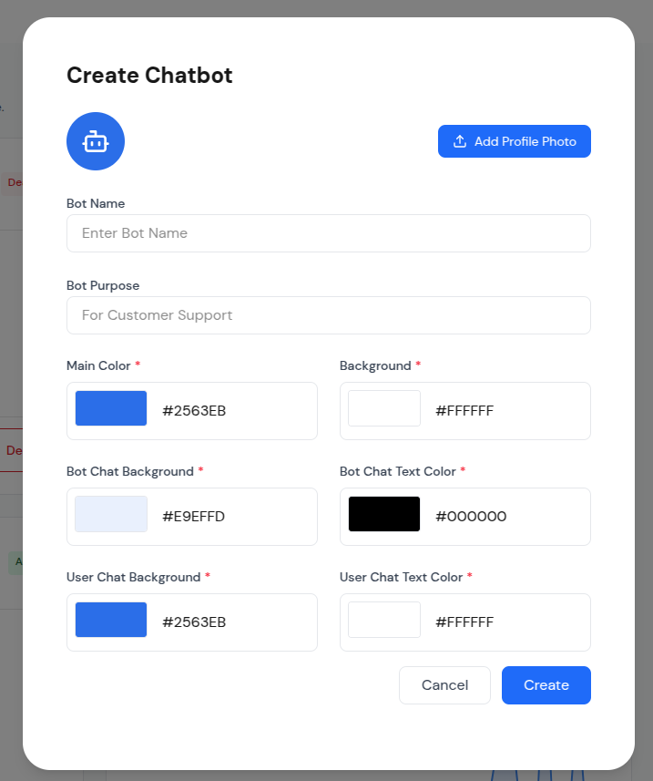
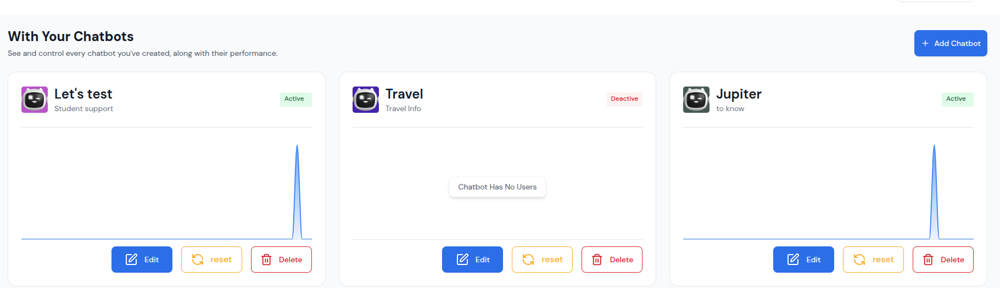
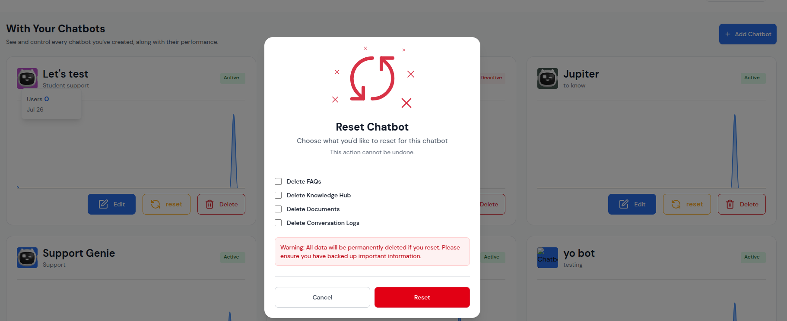
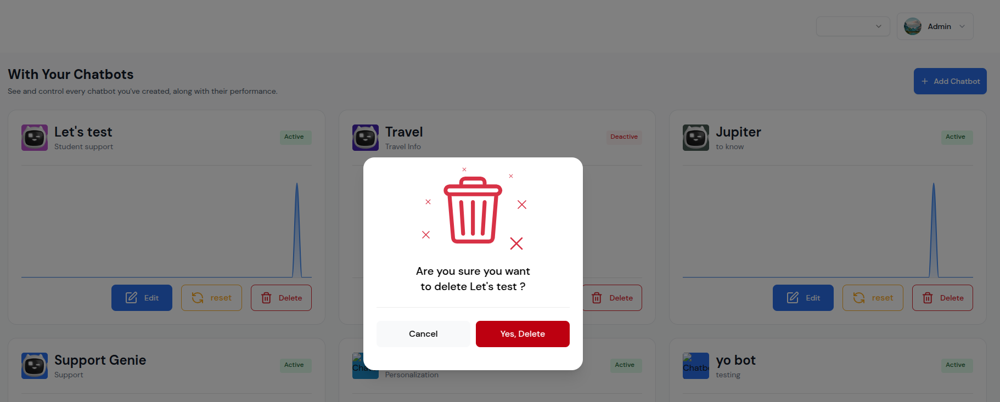
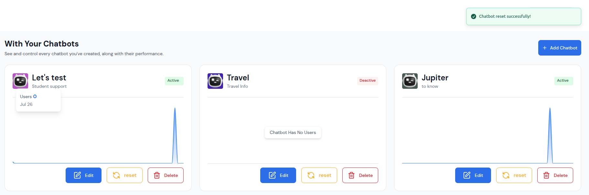
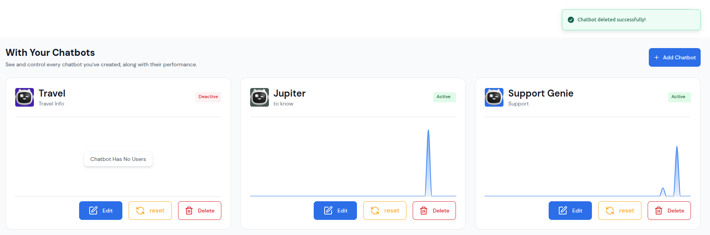

# Chat Bots Management Setup Guide

This guide provides comprehensive instructions for setting up and configuring the Chat Bots Management system. Follow these steps to effectively manage multiple AI chat bots from a single dashboard.

## Prerequisites

Before setting up Chat Bots Management, ensure you have:

- **Admin Access**: Administrator privileges to access the dashboard
- **Bot Creation Rights**: Permissions to create and manage chat bots
- **System Requirements**: Compatible browser and internet connection
- **API Access**: Access to AI model APIs for bot functionality
- **Storage Space**: Sufficient storage for bot data and configurations

## Initial Setup

### Step 1: Access the Dashboard
1. **Login**: Log into your admin account
2. **Navigate**: Go to Dashboard > Chat Bots
3. **Verify Access**: Ensure you can see the "With Your Chatbots" interface
4. **Check Permissions**: Verify you have create, edit, and delete permissions

### Step 2: Configure System Settings
1. **API Configuration**: Set up AI model API keys
2. **Storage Settings**: Configure data storage options
3. **Performance Settings**: Set up monitoring and analytics
4. **Security Settings**: Configure access controls and permissions

## Creating Your First Chat Bot

### Step 1: Open Create Modal

*Click the blue "+ Add Chatbot" button to open the creation modal*

### Step 2: Configure Basic Information
1. **Bot Name**: Enter a descriptive name (e.g., "Customer Support Bot")
2. **Bot Purpose**: Define the bot's primary function (e.g., "Customer Support")
3. **Profile Photo**: Upload a custom profile picture (optional)
4. **Required Fields**: Ensure all required fields are completed

### Step 3: Configure Color Scheme
1. **Main Color**: Set primary color for bot elements (#2563EB)
2. **Background**: Choose background color (#FFFFFF)
3. **Bot Chat Background**: Set bot message background (#E9EFFD)
4. **Bot Chat Text Color**: Choose bot text color (#000000)
5. **User Chat Background**: Set user message background (#2563EB)
6. **User Chat Text Color**: Choose user text color (#FFFFFF)

### Step 4: Create the Bot
1. **Review Settings**: Double-check all configurations
2. **Click Create**: Click the blue "Create" button
3. **Wait for Creation**: Allow the bot creation process to complete
4. **Verify Success**: Check that the bot appears in the dashboard

## Managing Multiple Chat Bots

### Dashboard Overview

*The main Chat Bots dashboard showing all chat bots with performance metrics*

### Bot Card Management
1. **View All Bots**: See all your chat bots in grid layout
2. **Check Status**: Monitor active/inactive status
3. **Review Performance**: Check usage graphs and metrics
4. **Access Actions**: Use edit, reset, and delete buttons

### Performance Monitoring
1. **Usage Graphs**: Monitor bot activity over time
2. **User Counts**: Track user engagement
3. **Status Updates**: Monitor bot status changes
4. **Trend Analysis**: Analyze usage patterns

## Bot Configuration Management

### Editing Bot Settings
1. **Click Edit Button**: Click the blue "Edit" button on any bot card
2. **Navigate to Settings**: Automatically redirects to bot settings page
3. **Configure Settings**: Access all bot configuration options
4. **Save Changes**: Save and apply configuration changes
5. **Return to Dashboard**: Navigate back to chat bots dashboard

### Settings Categories
- **General Settings**: Bot name, purpose, and basic information
- **Chat Settings**: Behavior, instructions, and tone
- **AI Model Settings**: Model selection and API configuration
- **Embed Settings**: Website integration and customization
- **Analytics Settings**: Performance tracking and reporting

## Data Management Operations

### Resetting Bot Data

*Click the orange "reset" button to open the reset options modal*

#### Reset Options
1. **Delete FAQs**: Remove all FAQ entries
2. **Delete Knowledge Hub**: Remove knowledge base content
3. **Delete Documents**: Remove uploaded documents
4. **Delete Conversation Logs**: Remove chat history

#### Reset Process
1. **Select Data to Reset**: Choose what data to reset
2. **Review Warning**: Read the warning message carefully
3. **Confirm Reset**: Click the red "Reset" button
4. **Wait for Completion**: Allow the reset process to complete
5. **Verify Success**: Check success notification

### Deleting Chat Bots

*Click the red "Delete" button to open the deletion confirmation modal*

#### Deletion Process
1. **Review Bot Name**: Verify you're deleting the correct bot
2. **Consider Consequences**: Understand that deletion is permanent
3. **Click "Yes, Delete"**: Confirm the deletion
4. **Wait for Completion**: Allow the deletion process to complete
5. **Verify Removal**: Check that bot is removed from dashboard

## Success Notifications

### Reset Success

*Green success banner appears after successful reset operation*

### Delete Success

*Dashboard updates automatically after successful bot deletion*

## Best Practices

### Bot Management
1. **Regular Monitoring**: Check bot performance regularly
2. **Status Management**: Keep bots active when needed
3. **Performance Analysis**: Monitor usage patterns and trends
4. **User Feedback**: Collect and analyze user feedback
5. **Continuous Improvement**: Update bots based on performance data

### Data Management
1. **Regular Backups**: Backup important bot data regularly
2. **Reset Planning**: Plan resets carefully to avoid data loss
3. **Performance Monitoring**: Monitor bot performance after changes
4. **User Communication**: Inform users about bot changes
5. **Rollback Plans**: Have rollback plans for major changes

### Security
1. **Access Control**: Limit access to authorized personnel
2. **API Security**: Secure API keys and credentials
3. **Data Protection**: Protect sensitive bot data
4. **Audit Logging**: Track all bot management operations
5. **Regular Updates**: Keep system and security measures updated

## Troubleshooting

### Common Issues
- **Bot Not Loading**: Check bot status and configuration
- **Performance Issues**: Monitor bot performance and usage
- **Reset Problems**: Verify reset options and data backup
- **Delete Issues**: Check bot dependencies and relationships

### Solutions
1. **Refresh Dashboard**: Reload page to resolve temporary issues
2. **Check Bot Status**: Verify bot is active and properly configured
3. **Monitor Performance**: Check usage patterns and performance metrics
4. **Contact Support**: Contact support for persistent issues

### Performance Optimization
1. **Regular Maintenance**: Perform regular system maintenance
2. **Monitor Resources**: Monitor system resources and usage
3. **Optimize Settings**: Optimize bot settings for performance
4. **Update Regularly**: Keep system and bots updated
5. **Monitor Analytics**: Use analytics to identify optimization opportunities

## Advanced Configuration

### Multi-Bot Management
1. **Bot Organization**: Organize bots by purpose or department
2. **Performance Comparison**: Compare performance across bots
3. **Resource Allocation**: Allocate resources based on bot importance
4. **Scaling Strategy**: Plan for scaling bot operations
5. **Integration Planning**: Plan integration with other systems

### Analytics and Reporting
1. **Performance Metrics**: Track key performance indicators
2. **User Analytics**: Monitor user engagement and satisfaction
3. **Usage Patterns**: Analyze usage patterns and trends
4. **ROI Analysis**: Measure return on investment for bot operations
5. **Reporting**: Generate regular reports on bot performance

## Maintenance and Updates

### Regular Maintenance
1. **System Updates**: Keep system updated with latest features
2. **Bot Updates**: Update bot configurations and knowledge bases
3. **Performance Monitoring**: Monitor system and bot performance
4. **Security Updates**: Apply security updates and patches
5. **Backup Verification**: Verify backup systems are working

### Monitoring and Alerts
1. **Performance Alerts**: Set up alerts for performance issues
2. **Error Monitoring**: Monitor for errors and issues
3. **Usage Alerts**: Set up alerts for unusual usage patterns
4. **Security Alerts**: Monitor for security issues
5. **Maintenance Alerts**: Set up alerts for maintenance needs

---

*This setup guide provides comprehensive instructions for managing multiple AI chat bots effectively. Follow these steps to optimize your bot management operations and ensure optimal performance.*

