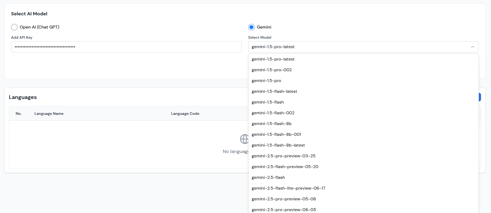
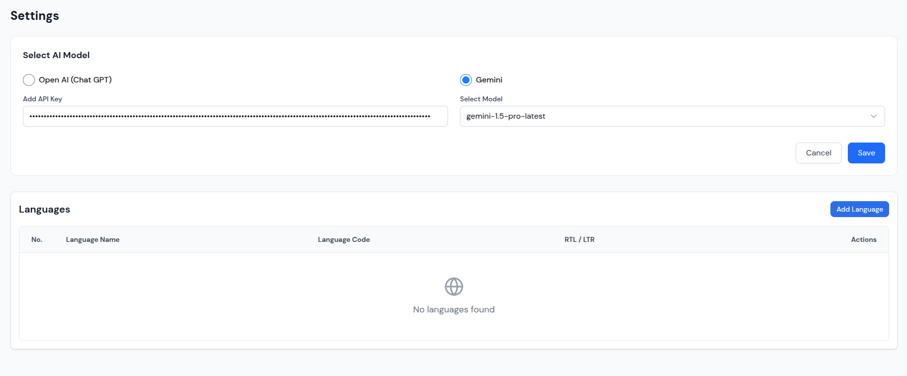
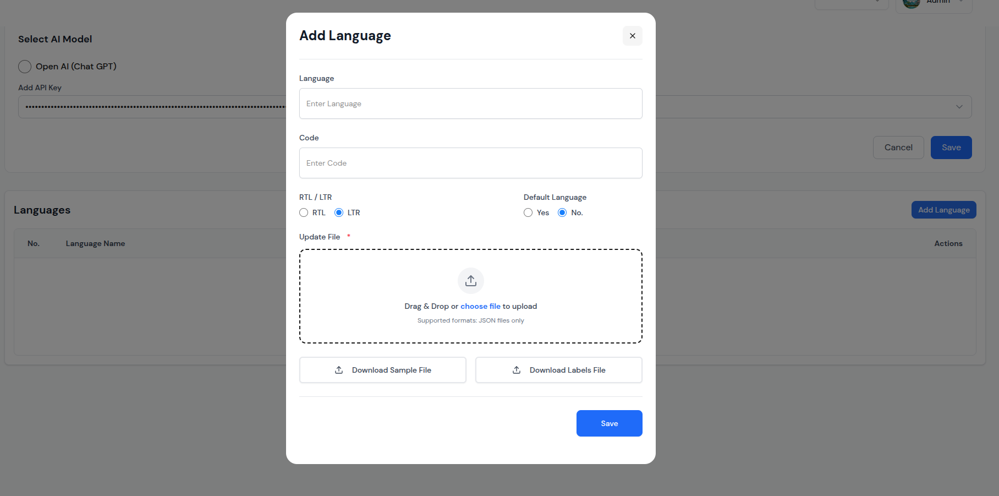
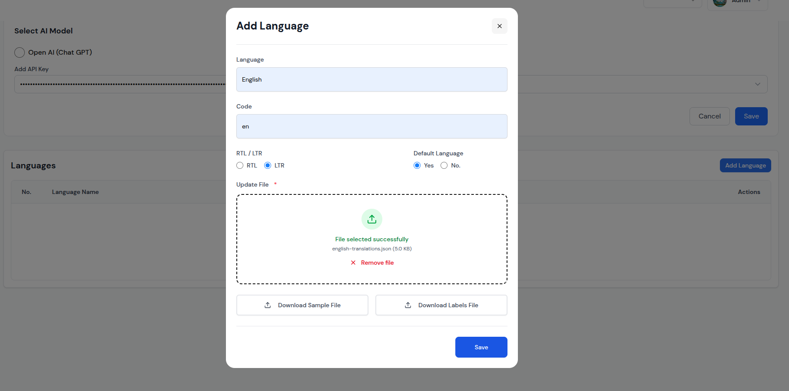
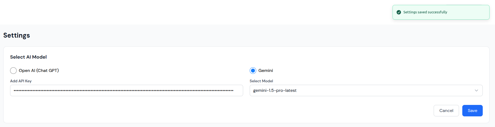
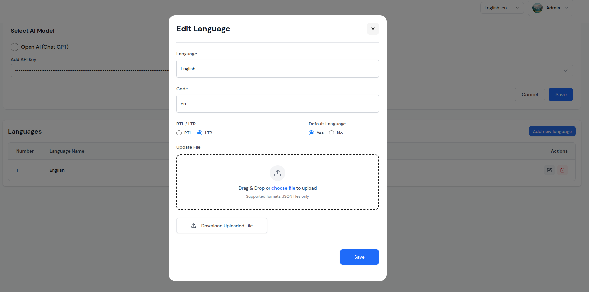
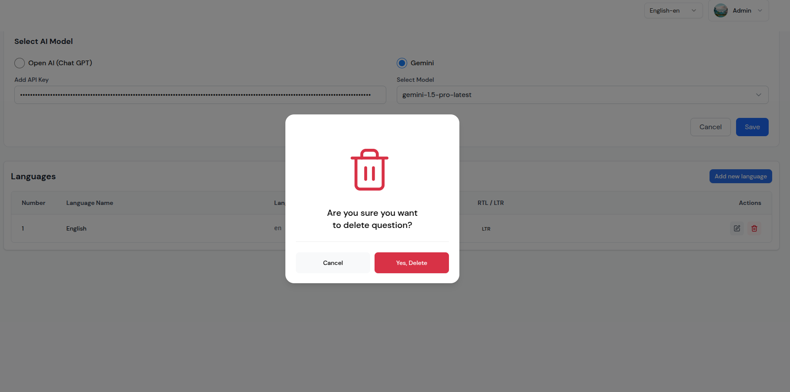
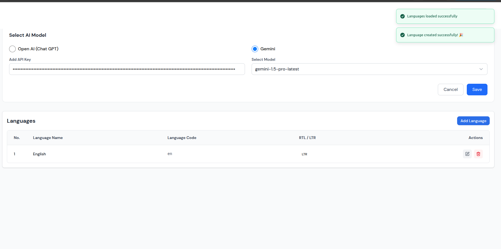

# Settings Management Setup Guide

This guide provides comprehensive instructions for setting up and configuring the Settings Management system. Follow these steps to effectively configure AI models and manage languages for your chat bots.

## Prerequisites

Before setting up Settings Management, ensure you have:

- **Admin Access**: Administrator privileges to access settings
- **API Keys**: Valid API keys for AI models (OpenAI or Gemini)
- **Translation Files**: JSON translation files for languages
- **System Requirements**: Compatible browser and internet connection
- **Storage Space**: Sufficient storage for translation files

## Initial Setup

### Step 1: Access Settings
1. **Login**: Log into your admin account
2. **Navigate**: Go to Dashboard > Settings
3. **Verify Access**: Ensure you can see the Settings interface
4. **Check Permissions**: Verify you have configuration permissions

### Step 2: Configure System Settings
1. **API Configuration**: Set up AI model API keys
2. **Model Selection**: Choose appropriate AI models
3. **Language Settings**: Configure default language
4. **Security Settings**: Configure access controls and permissions

## AI Model Configuration

### Step 1: Select AI Model

*Choose between OpenAI and Gemini models with available options*

### Step 2: Configure API Keys
1. **OpenAI Configuration**:
   - Select "Open AI (Chat GPT)" radio button
   - Enter your OpenAI API key in the "Add API Key" field
   - Verify the API key is valid and active
   - Test the connection to ensure it works

2. **Gemini Configuration**:
   - Select "Gemini" radio button
   - Enter your Gemini API key in the "Add API Key" field
   - Choose specific model version from dropdown
   - Test the connection to ensure it works

### Step 3: Select Model Version
1. **Model Options**: Choose from available model versions
2. **Performance Testing**: Test different models for optimal performance
3. **Cost Consideration**: Consider API costs for different models
4. **Feature Support**: Ensure model supports required features

### Step 4: Save Configuration
1. **Review Settings**: Double-check all configurations
2. **Click Save**: Click the blue "Save" button
3. **Wait for Confirmation**: Allow the save process to complete
4. **Verify Success**: Check for "Settings saved successfully" notification

## Language Management Setup

### Step 1: Access Languages Section

*View the Languages section with current language configurations*

### Step 2: Add New Language

*Click "Add Language" button to open the creation modal*

### Step 3: Configure Language Details

*Enter language information and configuration settings*

#### Basic Information
1. **Language Name**: Enter full language name (e.g., "English")
2. **Language Code**: Enter short code (e.g., "en")
3. **Text Direction**: Select RTL or LTR
4. **Default Status**: Set as default language or not

#### File Upload Configuration
1. **Translation File**: Upload JSON translation file
2. **File Format**: Ensure file is in proper JSON format
3. **File Size**: Keep file within reasonable size limits
4. **File Validation**: Verify file is properly formatted

### Step 4: Upload Translation Files
1. **Drag & Drop**: Drag translation files to upload area
2. **File Selection**: Click "choose file" to browse files
3. **File Validation**: Ensure JSON format is correct
4. **File Management**: Remove or replace uploaded files

### Step 5: Save Language

*Click "Save" to create the new language*

## Language Operations

### Editing Existing Languages

*Click the pencil icon to edit existing language settings*

#### Edit Process
1. **Click Edit Icon**: Click the pencil icon for any language
2. **Modify Details**: Update language information
3. **Update Files**: Upload new translation files
4. **Save Changes**: Click "Save" to update language

### Deleting Languages

*Click the trash can icon to delete languages*

#### Deletion Process
1. **Click Delete Icon**: Click the red trash can icon
2. **Confirmation Modal**: "Are you sure you want to delete question?" appears
3. **Confirm Deletion**: Click "Yes, Delete" to confirm
4. **Language Removal**: Language is permanently deleted

## Success Notifications

### Settings Saved Successfully

*Green success banners appear for successful operations*

#### Notification Types
- **Settings Saved**: "Settings saved successfully" message
- **Language Created**: "Language created successfully! 🎉" with party emoji
- **Languages Loaded**: "Languages loaded successfully" message
- **Visual Feedback**: Clear indication of successful operations

## Best Practices

### AI Model Configuration
1. **API Key Security**: Keep API keys secure and updated
2. **Model Selection**: Choose appropriate models for your use case
3. **Performance Testing**: Test different models for optimal performance
4. **Cost Management**: Monitor API usage and costs
5. **Backup Configuration**: Keep backup of working configurations

### Language Management
1. **Translation Quality**: Ensure high-quality translation files
2. **File Format**: Use proper JSON format for translation files
3. **Testing**: Test all languages before making them active
4. **Documentation**: Document language configurations
5. **Regular Updates**: Keep translation files updated

### File Management
1. **File Format**: Use JSON format for translation files
2. **File Size**: Keep files within reasonable size limits
3. **File Validation**: Ensure files are properly formatted
4. **Backup Files**: Keep backup copies of translation files
5. **Version Control**: Manage different versions of translation files

## Troubleshooting

### Common Issues
- **Settings Not Saving**: Check API key validity and permissions
- **Language Not Loading**: Verify translation file format
- **Model Not Working**: Check API key and model availability
- **File Upload Issues**: Verify file format and size

### Solutions
1. **Refresh Page**: Reload page to resolve temporary issues
2. **Check API Keys**: Verify API keys are valid and active
3. **Validate Files**: Ensure translation files are properly formatted
4. **Contact Support**: Contact support for persistent issues

### Performance Optimization
1. **Regular Maintenance**: Perform regular system maintenance
2. **Monitor Resources**: Monitor system resources and usage
3. **Optimize Settings**: Optimize settings for performance
4. **Update Regularly**: Keep system and settings updated
5. **Monitor Analytics**: Use analytics to identify optimization opportunities

## Advanced Configuration

### Multi-Language Support
1. **Language Organization**: Organize languages by region or purpose
2. **Translation Management**: Manage translation files effectively
3. **Quality Control**: Ensure translation quality
4. **User Experience**: Consider user experience for different languages
5. **Testing**: Test all languages thoroughly

### AI Model Optimization
1. **Model Comparison**: Compare different models for performance
2. **Cost Analysis**: Analyze costs for different models
3. **Feature Support**: Ensure models support required features
4. **Performance Monitoring**: Monitor model performance
5. **Backup Models**: Have alternative models ready

## Maintenance and Updates

### Regular Maintenance
1. **System Updates**: Keep system updated with latest features
2. **Language Updates**: Update translation files regularly
3. **Performance Monitoring**: Monitor system and model performance
4. **Security Updates**: Apply security updates and patches
5. **Backup Verification**: Verify backup systems are working

### Monitoring and Alerts
1. **Performance Alerts**: Set up alerts for performance issues
2. **Error Monitoring**: Monitor for errors and issues
3. **Usage Alerts**: Set up alerts for unusual usage patterns
4. **Security Alerts**: Monitor for security issues
5. **Maintenance Alerts**: Set up alerts for maintenance needs

---

*This setup guide provides comprehensive instructions for managing settings effectively. Follow these steps to optimize your AI chat bot configuration and ensure optimal performance.*

