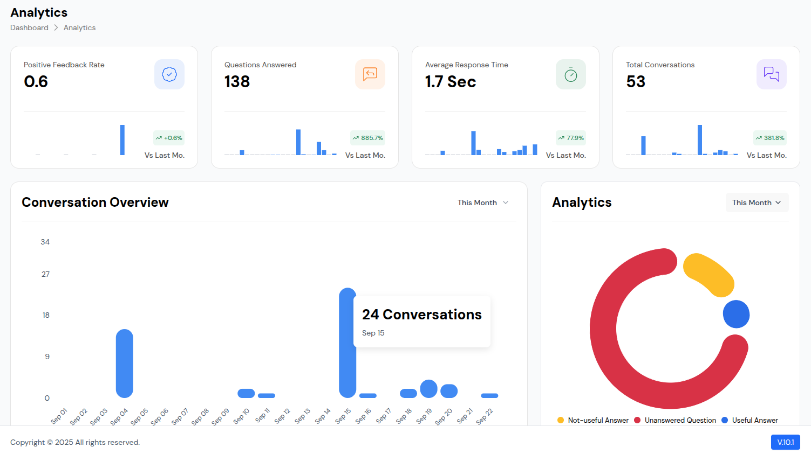
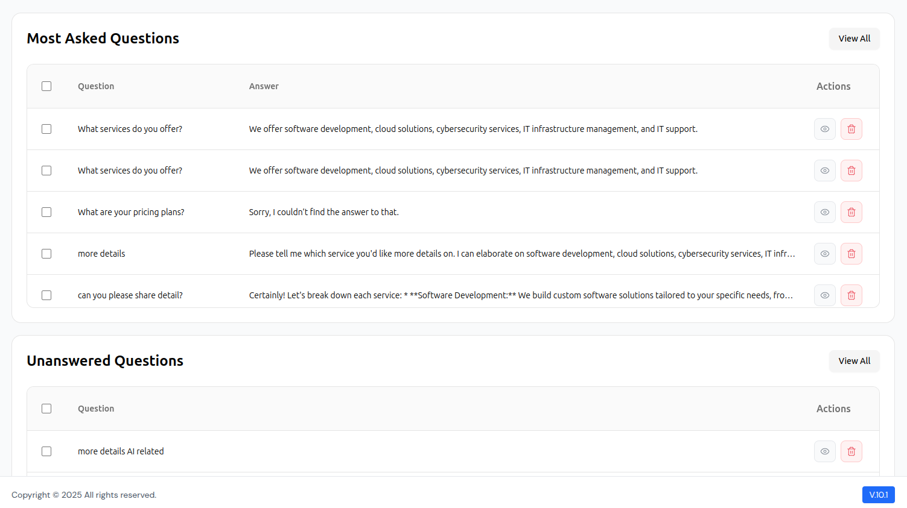

# Analytics Dashboard

Comprehensive analytics and reporting system that provides detailed insights into your platform's performance, user behavior, and business metrics.

## Key Features

### 📊 Real-Time Analytics
- **Live Dashboard**: Monitor key metrics in real-time with auto-refreshing data
- **Performance Tracking**: Track system performance, response times, and uptime
- **User Activity**: Monitor active users, sessions, and engagement levels
- **Revenue Tracking**: Real-time revenue and transaction monitoring

### 📈 Business Intelligence
- **Revenue Analytics**: Detailed revenue breakdown by service, provider, and time period
- **Commission Tracking**: Monitor provider commissions and platform earnings
- **Growth Metrics**: Track user growth, booking trends, and market expansion
- **Profitability Analysis**: Analyze profit margins and cost structures

### 👥 User Behavior Analytics
- **User Journey Mapping**: Track user paths from registration to booking completion
- **Engagement Metrics**: Monitor app usage, feature adoption, and user retention
- **Geographic Analytics**: Analyze user distribution and service demand by location
- **Device & Platform Analytics**: Track usage across different devices and platforms

### 🔍 Service Performance Analytics
- **Service Popularity**: Identify top-performing services and categories
- **Provider Performance**: Track provider ratings, completion rates, and earnings
- **Booking Analytics**: Analyze booking patterns, cancellation rates, and rescheduling
- **Service Quality Metrics**: Monitor service delivery times and customer satisfaction

### 📱 Platform Analytics
- **App Performance**: Track app crashes, loading times, and technical issues
- **Feature Usage**: Monitor which features are most/least used
- **Conversion Funnels**: Analyze user conversion from discovery to booking
- **Retention Analysis**: Track user retention rates and churn patterns

### 📊 Custom Reports & Dashboards
- **Custom Dashboards**: Create personalized dashboards for different stakeholders
- **Scheduled Reports**: Automated report generation and delivery
- **Export Options**: Export data in multiple formats (PDF, Excel, CSV)
- **Data Visualization**: Interactive charts, graphs, and heat maps

### 🎯 Advanced Analytics Features
- **Predictive Analytics**: Forecast trends and user behavior patterns
- **A/B Testing Results**: Track and analyze feature testing outcomes
- **Cohort Analysis**: Analyze user groups and their behavior over time
- **Segmentation**: Segment users and providers for targeted insights

### 📈 Performance Metrics
- **Key Performance Indicators (KPIs)**: Track critical business metrics
- **Goal Setting**: Set and monitor business objectives
- **Benchmarking**: Compare performance against industry standards
- **Trend Analysis**: Identify patterns and seasonal variations

### 🔔 Smart Alerts & Notifications
- **Threshold Alerts**: Get notified when metrics exceed or fall below set thresholds
- **Anomaly Detection**: Automatic detection of unusual patterns or issues
- **Performance Alerts**: Monitor system health and performance issues
- **Business Alerts**: Track important business milestones and changes

### 📋 Reporting Features
- **Executive Summaries**: High-level reports for management and stakeholders
- **Detailed Reports**: Comprehensive reports with drill-down capabilities
- **Comparative Analysis**: Compare performance across different time periods
- **ROI Analysis**: Calculate return on investment for marketing and features

### 🛠️ Integration & API
- **Third-Party Integrations**: Connect with external analytics tools
- **API Access**: Programmatic access to analytics data
- **Data Export**: Export raw data for external analysis
- **Webhook Support**: Real-time data streaming to external systems

## Benefits

- **Data-Driven Decisions**: Make informed business decisions based on comprehensive data
- **Performance Optimization**: Identify and resolve performance bottlenecks
- **User Experience Improvement**: Understand user behavior to enhance platform experience
- **Revenue Optimization**: Identify opportunities to increase revenue and profitability
- **Competitive Advantage**: Gain insights to stay ahead of the competition

## Use Cases

- **Business Owners**: Monitor overall platform performance and business health
- **Marketing Teams**: Track campaign effectiveness and user acquisition
- **Operations Teams**: Monitor service delivery and provider performance
- **Development Teams**: Track app performance and technical metrics
- **Finance Teams**: Monitor revenue, costs, and profitability metrics

### 🌍 Language Analytics & Localization
- **Language Usage Analytics**: Track which languages are most/least used across the platform
- **Regional Language Preferences**: Analyze language preferences by geographic location
- **Translation Performance**: Monitor translation quality and user feedback
- **Localization Metrics**: Track content localization effectiveness and user engagement
- **Language-Specific User Behavior**: Analyze how different language users interact with the platform
- **Multi-Language Support Analytics**: Monitor support ticket resolution across different languages
- **Content Localization ROI**: Measure the impact of localized content on user engagement
- **Language Conversion Rates**: Track conversion rates for different language versions
- **Cultural Adaptation Metrics**: Monitor how well content adapts to different cultural contexts
- **Language-Specific Feature Usage**: Track which features are most popular in different languages

### 🗣️ Communication Analytics
- **Language Preference Tracking**: Monitor user language preferences and changes over time
- **Cross-Language User Journeys**: Track users who switch between languages
- **Language-Specific Support Analytics**: Analyze support quality across different languages
- **Translation Accuracy Metrics**: Monitor translation quality and user satisfaction
- **Localized Content Performance**: Track performance of localized vs. original content
- **Language-Based Segmentation**: Segment users by language for targeted analytics
- **Cultural Context Analytics**: Analyze how cultural differences affect user behavior
- **Language-Specific Marketing Analytics**: Track marketing campaign effectiveness by language
- **Multi-Language SEO Analytics**: Monitor search performance across different languages
- **Language Accessibility Metrics**: Track accessibility features across different languages

### 📊 Language Dashboard Features
- **Language Usage Heat Maps**: Visual representation of language usage by region
- **Translation Status Tracking**: Monitor translation completion and quality
- **Language-Specific KPIs**: Track key metrics for each supported language
- **Cross-Language Comparison**: Compare performance metrics across languages
- **Language Growth Analytics**: Track adoption of new languages over time
- **Localization Impact Analysis**: Measure the impact of localization on user engagement
- **Language-Specific Revenue Analytics**: Track revenue generation by language
- **Cultural Adaptation Insights**: Analyze how cultural factors affect platform usage
- **Language Accessibility Reports**: Generate reports on language accessibility features
- **Multi-Language User Experience Metrics**: Track UX metrics across different languages

### 🔧 Language Management Tools
- **Translation Workflow Analytics**: Monitor translation workflow efficiency
- **Language Content Analytics**: Track content performance across languages
- **Localization Quality Metrics**: Monitor and improve localization quality
- **Language-Specific A/B Testing**: Conduct A/B tests across different languages
- **Cultural Sensitivity Analytics**: Monitor content for cultural appropriateness
- **Language Accessibility Compliance**: Track compliance with language accessibility standards
- **Multi-Language Performance Monitoring**: Monitor platform performance across languages
- **Language-Specific Error Tracking**: Track and resolve language-specific issues
- **Localization ROI Analysis**: Calculate return on investment for localization efforts
- **Language Community Analytics**: Track engagement within language-specific communities

### 📈 Language Growth & Expansion
- **New Language Adoption**: Track adoption rates for newly added languages
- **Language Market Analysis**: Analyze market potential for different languages
- **Localization Priority Analytics**: Determine which languages to prioritize for localization
- **Language-Specific User Acquisition**: Track user acquisition by language
- **Cross-Language User Migration**: Monitor users switching between languages
- **Language Retention Analytics**: Track user retention by language preference
- **Cultural Market Penetration**: Analyze penetration in different cultural markets
- **Language-Specific Feature Requests**: Track feature requests by language community
- **Localization Investment Analytics**: Optimize investment in language localization
- **Global Language Trends**: Monitor global trends in language usage and preferences

