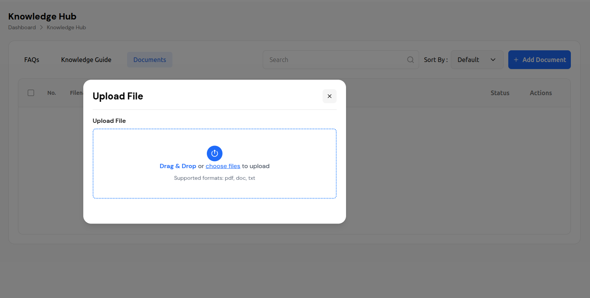
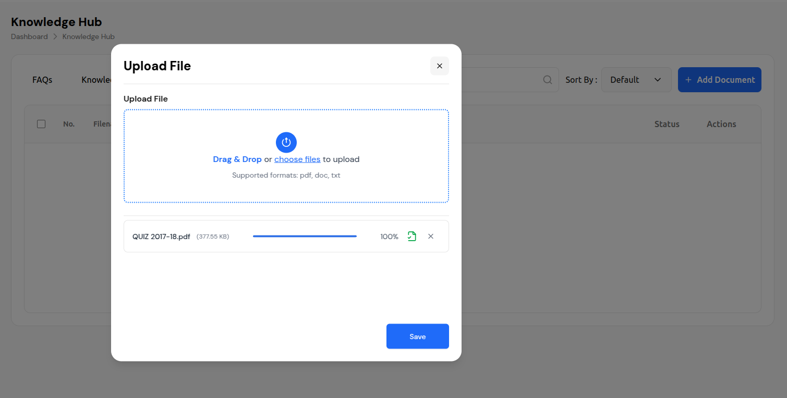
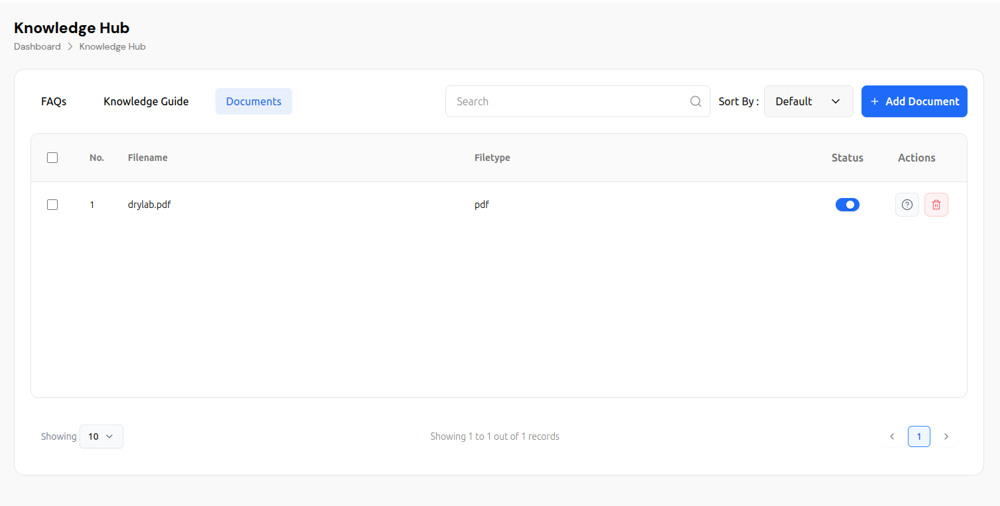

# Knowledge Hub - Document Management System

The Knowledge Hub is a comprehensive document management system that allows users to upload, organize, and manage various types of documents for their chatbots. This feature enables you to create a knowledge base that can be used to train and enhance your chatbot's responses.

## Overview

The Knowledge Hub provides three main sections:
- **FAQs** - Frequently Asked Questions management
- **Knowledge Guide** - Comprehensive guides and documentation
- **Documents** - File-based document management

## Main Interface

### Navigation Structure
```
Dashboard > Knowledge Hub
```

The interface features a clean, modern design with:
- **Header**: Displays "Knowledge Hub" title with breadcrumb navigation
- **Tab Navigation**: Three main sections (FAQs, Knowledge Guide, Documents)
- **Search & Filter**: Advanced search and sorting capabilities
- **Document Management**: Upload, organize, and manage documents

## Document Management Features

### Document Upload Process

- Click the **"+ Add Document"** button in the top-right corner
- This opens the "Upload File" modal dialog


*Click the "+ Add Document" button to open the upload modal*
- Click the **"+ Add Document"** button in the top-right corner
- This opens the "Upload File" modal dialog

The upload modal provides:
- **Drag #### 2. Upload Interface Drop Zone**: Large rectangular area with dashed blue border
- **File Selection**: Click "choose files" to browse local files
- **Supported Formats**: PDF, DOC, TXT files
- **Visual Feedback**: Blue circular upload icon with arrow


*The upload modal provides a drag-and-drop interface with clear instructions*
The upload modal provides:
- **Drag & Drop Zone**: Large rectangular area with dashed blue border
- **File Selection**: Click "choose files" to browse local files
- **Supported Formats**: PDF, DOC, TXT files
- **Visual Feedback**: Blue circular upload icon with arrow

1. **File Selection**: Drag files into the drop zone or click to browse
2. **File Validation**: System validates file format and size
3. **Upload Progress**: Real-time progress bar shows upload status
4. **Completion**: Green checkmark indicates successful upload
5. **Save**: Click "Save" button to finalize the upload


*File upload completed successfully with progress indicator and save option*
1. **File Selection**: Drag files into the drop zone or click to browse
2. **File Validation**: System validates file format and size
3. **Upload Progress**: Real-time progress bar shows upload status
4. **Completion**: Green checkmark indicates successful upload
5. **Save**: Click "Save" button to finalize the upload

### Document Management Table

#### Table Structure
The document table includes the following columns:

| Column | Description |
|--------|-------------|
| **Checkbox** | Select multiple documents for bulk operations |
| **No.** | Sequential document number |
| **Filename** | Original file name |
| **Filetype** | File extension (pdf, doc, txt) |
| **Status** | Active/Inactive toggle switch |
| **Actions** | View details and delete options |

#### Document Actions
- **Status Toggle**: Blue switch to activate/deactivate documents
- **View Details**: Question mark icon for document information
- **Delete**: Red trash can icon to remove documents

### Search and Filtering

#### Search Functionality
- **Search Bar**: Located in the top-left with magnifying glass icon
- **Real-time Search**: Instant filtering as you type
- **Search Scope**: Searches across filename, content, and metadata

#### Sorting Options
- **Sort By Dropdown**: Located next to search bar
- **Default Sorting**: Currently set to "Default"
- **Available Options**: Likely includes date, name, size, type

### Pagination and Records

#### Record Management
- **Records Per Page**: Dropdown showing "10" records per page
- **Record Summary**: "Showing 1 to 1 out of 1 records"
- **Pagination**: Standard pagination controls with arrows and page numbers

## File Upload Specifications

### Supported File Formats
- **PDF**: Portable Document Format files
- **DOC**: Microsoft Word documents
- **TXT**: Plain text files

### Upload Process Details
1. **File Size**: No specific limit mentioned, but progress tracking suggests reasonable limits
2. **File Validation**: Automatic format checking before upload
3. **Progress Tracking**: Real-time upload progress with percentage
4. **Error Handling**: Visual feedback for upload issues

### Upload Status Indicators
- **Progress Bar**: Blue horizontal bar showing upload percentage
- **Completion Icon**: Green checkmark for successful uploads
- **File Information**: Displays filename and file size
- **Remove Option**: X icon to cancel or remove uploaded files

## User Interface Elements

### Visual Design
- **Color Scheme**: Clean white background with blue accents
- **Typography**: Clear, readable fonts with proper hierarchy
- **Icons**: Intuitive icons for actions (upload, delete, view)
- **Layout**: Responsive design with logical information flow

### Interactive Elements
- **Hover Effects**: Visual feedback on interactive elements
- **Loading States**: Progress indicators during operations
- **Modal Dialogs**: Overlay modals for focused interactions
- **Toggle Switches**: Easy status management for documents

## Best Practices

### File Organization
1. **Naming Convention**: Use descriptive filenames
2. **File Types**: Choose appropriate formats for content
3. **File Size**: Keep files reasonably sized for better performance
4. **Content Quality**: Ensure documents are well-formatted and relevant

### Document Management
1. **Regular Updates**: Keep knowledge base current
2. **Status Management**: Activate only relevant documents
3. **Bulk Operations**: Use checkboxes for multiple document actions
4. **Search Optimization**: Use clear, searchable filenames

## Technical Features

### File Processing
- **Format Validation**: Automatic checking of supported formats
- **Size Optimization**: Efficient file handling and storage
- **Metadata Extraction**: Automatic extraction of file information
- **Content Indexing**: Searchable content within documents

### Performance
- **Progress Tracking**: Real-time upload progress
- **Error Handling**: Graceful handling of upload failures
- **Responsive Design**: Works across different screen sizes
- **Fast Search**: Quick document retrieval and filtering

## Integration with Chatbot

The Knowledge Hub serves as the foundation for your chatbot's knowledge base:

1. **Training Data**: Documents become part of the chatbot's training material
2. **Response Enhancement**: Uploaded content improves answer quality
3. **Content Management**: Easy addition and removal of knowledge sources
4. **Performance Tracking**: Monitor which documents are most effective

## Troubleshooting

### Common Issues
- **Upload Failures**: Check file format and size
- **Search Issues**: Verify document status is active
- **Display Problems**: Ensure proper file permissions
- **Performance**: Monitor file sizes and quantities

### Support
For technical issues or questions about the Knowledge Hub:
- Check file format compatibility
- Verify upload permissions
- Contact support for advanced troubleshooting
- Review system requirements for optimal performance

---

*This documentation covers the Knowledge Hub feature as shown in the interface. The system provides a comprehensive solution for managing chatbot knowledge bases through an intuitive, user-friendly interface.*

## Visual Guide

### Document Upload Process

#### Step 1: Accessing the Upload Modal

*Click the "+ Add Document" button to open the upload modal*

#### Step 2: Upload Interface

*The upload modal provides a drag-and-drop interface with clear instructions*

#### Step 3: Successful Upload

*File upload completed successfully with progress indicator and save option*

### Upload Process Workflow

1. **Initial State**: Click the "+ Add Document" button to open the upload modal
2. **File Selection**: Use the drag-and-drop area or click "choose files" to select documents
3. **Upload Progress**: Monitor the real-time progress bar during file upload
4. **Completion**: Confirm successful upload with the green checkmark and save the document

### Key Visual Elements

- **Upload Button**: Prominent blue button with plus icon
- **Drag & Drop Zone**: Dashed blue border with upload icon
- **Progress Tracking**: Blue progress bar with percentage display
- **Success Indicator**: Green checkmark for completed uploads
- **File Information**: Displays filename and file size
- **Action Buttons**: Save and cancel options for finalizing uploads

