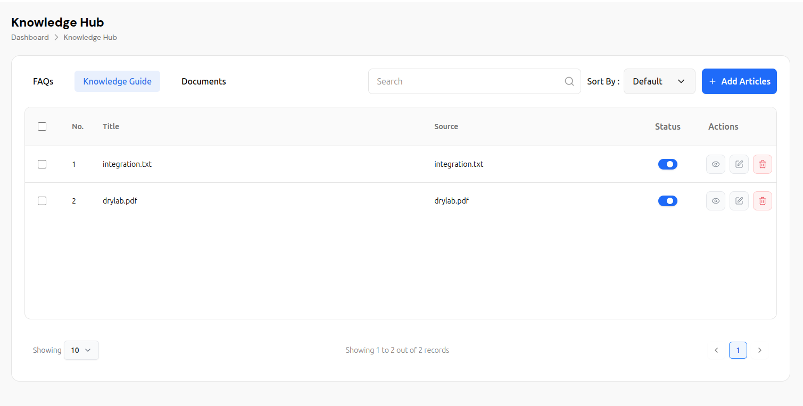
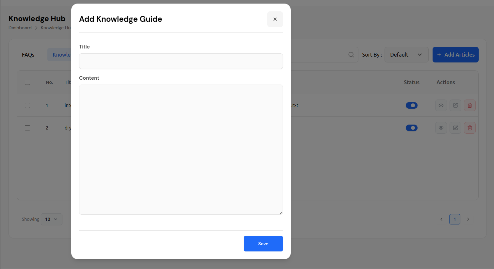
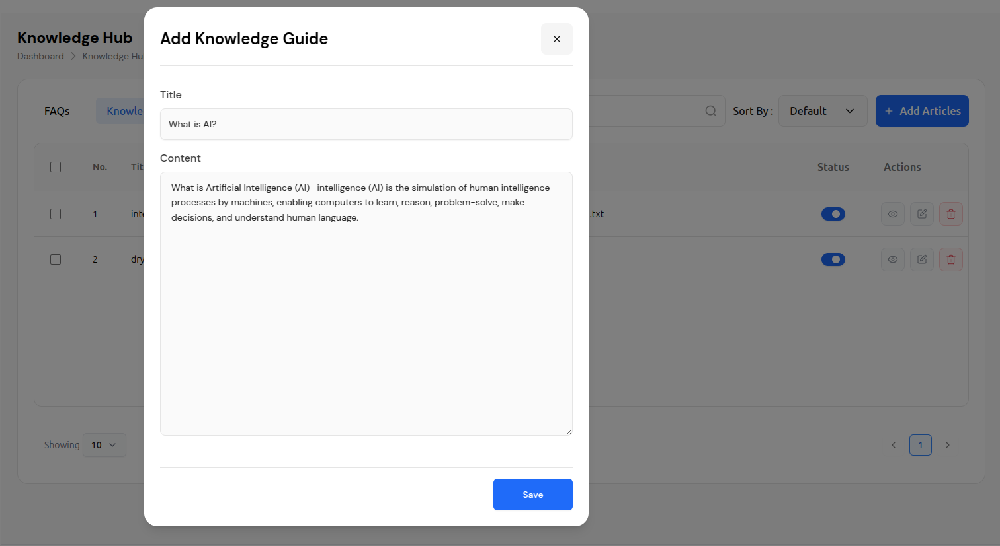
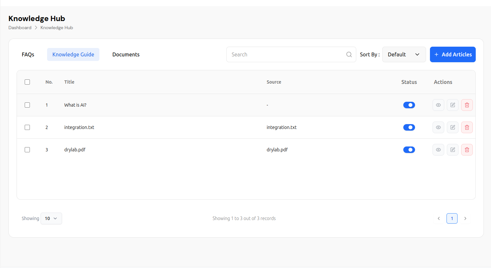
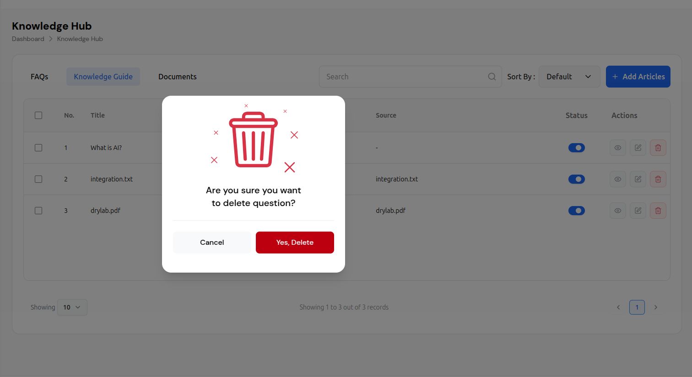
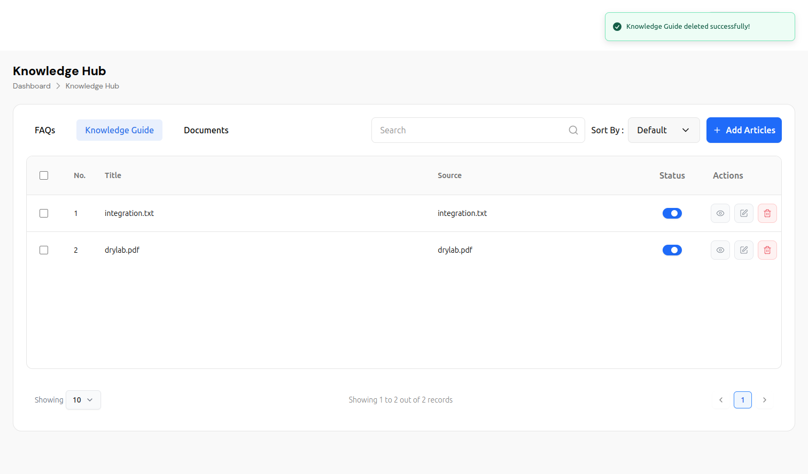

# Knowledge Guide Management System

The Knowledge Guide is a comprehensive article management system that allows users to create, organize, and manage knowledge articles for their chatbots. This feature enables you to build a structured knowledge base with rich content that enhances your chatbot's ability to provide accurate and helpful responses.

## Overview

The Knowledge Guide provides a complete content management solution with:
- **Article Creation**: Rich text editor for creating knowledge articles
- **Content Organization**: Structured article management with titles and content
- **Status Management**: Active/inactive toggle for article visibility
- **Search & Filter**: Advanced search and sorting capabilities
- **Bulk Operations**: Multi-select functionality for batch operations

## Main Interface

### Navigation Structure
```
Dashboard > Knowledge Hub > Knowledge Guide
```

The interface features a clean, modern design with:
- **Header**: Displays "Knowledge Hub" title with breadcrumb navigation
- **Tab Navigation**: Three main sections (FAQs, Knowledge Guide, Documents)
- **Search & Filter**: Advanced search and sorting capabilities
- **Article Management**: Create, edit, and manage knowledge articles

## Knowledge Guide Features

### Article Creation Process

#### 1. Accessing Article Creation
- Click the **"+ Add Articles"** button in the top-right corner
- This opens the "Add Knowledge Guide" modal dialog

#### 2. Article Creation Interface
The creation modal provides:
- **Title Field**: Single-line text input for article title
- **Content Field**: Multi-line text area for article content
- **Rich Text Support**: Full content editing capabilities
- **Save Functionality**: Blue "Save" button to create the article

#### 3. Article Creation Workflow
1. **Title Entry**: Enter a descriptive title for the article
2. **Content Writing**: Add detailed content in the text area
3. **Content Validation**: System validates content before saving
4. **Save Article**: Click "Save" button to create the article
5. **Status Management**: Article is created with active status by default

### Article Management Table

#### Table Structure
The article table includes the following columns:

| Column | Description |
|--------|-------------|
| **Checkbox** | Select multiple articles for bulk operations |
| **No.** | Sequential article number |
| **Title** | Article title and name |
| **Source** | Source file or origin (if applicable) |
| **Status** | Active/Inactive toggle switch |
| **Actions** | View, edit, and delete options |

- **View**: Eye icon to preview article content
- **Edit**: Pencil icon to modify article content
- **Delete**: Red trash can icon to remove articles
- **Status Toggle**: Blue switch to activate/deactivate articles

### Deletion Workflow
1. **Click Delete**: Select the red trash can icon for the article
2. **Confirmation Modal**: System displays deletion confirmation dialog
3. **User Confirmation**: Choose to cancel or confirm deletion
4. **Success Feedback**: System shows success message after deletion
- **View**: Eye icon to preview article content
- **Edit**: Pencil icon to modify article content
- **Delete**: Red trash can icon to remove articles
- **Status Toggle**: Blue switch to activate/deactivate articles

### Content Management Features

#### Article Types
The system supports different types of content:
- **Text Articles**: Pure text-based knowledge articles
- **File-based Articles**: Articles created from uploaded documents
- **Mixed Content**: Articles with both text and file sources

#### Content Examples
- **AI Articles**: "What is AI?" - Educational content about artificial intelligence
- **Integration Guides**: "integration.txt" - Technical documentation
- **Resource Files**: "drylab.pdf" - Reference materials and guides

### Search and Filtering

#### Search Functionality
- **Search Bar**: Located in the top-left with magnifying glass icon
- **Real-time Search**: Instant filtering as you type
- **Search Scope**: Searches across article titles, content, and metadata

#### Sorting Options
- **Sort By Dropdown**: Located next to search bar
- **Default Sorting**: Currently set to "Default"
- **Available Options**: Likely includes date, title, status, source

### Pagination and Records

#### Record Management
- **Records Per Page**: Dropdown showing "10" records per page
- **Record Summary**: "Showing 1 to 3 out of 3 records"
- **Pagination**: Standard pagination controls with arrows and page numbers

## Article Creation Specifications

### Content Requirements
- **Title**: Descriptive and clear article titles
- **Content**: Rich text content with proper formatting
- **Length**: No specific limits, but recommended for readability
- **Format**: Plain text with support for structured content

### Article Status Management
- **Active Status**: Blue toggle switch indicates active articles
- **Inactive Status**: Gray toggle switch indicates inactive articles
- **Status Control**: Easy toggle between active/inactive states
- **Bulk Status**: Ability to change status for multiple articles

### Content Organization
- **Sequential Numbering**: Automatic numbering for article organization
- **Source Tracking**: Track original source files for articles
- **Status Visibility**: Clear indication of article status
- **Action Accessibility**: Easy access to view, edit, and delete functions

## User Interface Elements

### Visual Design
- **Color Scheme**: Clean white background with blue accents
- **Typography**: Clear, readable fonts with proper hierarchy
- **Icons**: Intuitive icons for actions (view, edit, delete)
- **Layout**: Responsive design with logical information flow

### Interactive Elements
- **Modal Dialogs**: Overlay modals for focused content creation
- **Toggle Switches**: Easy status management for articles
- **Action Buttons**: Clear call-to-action buttons
- **Form Elements**: User-friendly input fields and text areas

## Best Practices

### Content Creation
1. **Clear Titles**: Use descriptive and searchable titles
2. **Structured Content**: Organize content with proper headings and sections
3. **Relevant Information**: Ensure content is accurate and up-to-date
4. **Regular Updates**: Keep knowledge base current and relevant

### Article Management
1. **Status Management**: Activate only relevant and current articles
2. **Content Quality**: Review and edit articles for accuracy
3. **Bulk Operations**: Use checkboxes for efficient management
4. **Search Optimization**: Use clear, searchable titles and content

## Technical Features

### Content Processing
- **Text Validation**: Automatic content validation and formatting
- **Search Indexing**: Full-text search across all article content
- **Status Management**: Efficient status tracking and updates
- **Bulk Operations**: Batch processing for multiple articles

### Performance
- **Fast Search**: Quick article retrieval and filtering
- **Responsive Design**: Works across different screen sizes
- **Efficient Management**: Streamlined article operations
- **Real-time Updates**: Immediate status and content updates

## Integration with Chatbot

The Knowledge Guide serves as the primary content source for your chatbot:

1. **Training Content**: Articles become part of the chatbot's knowledge base
2. **Response Enhancement**: Rich content improves answer quality
3. **Content Management**: Easy addition and removal of knowledge sources
4. **Performance Tracking**: Monitor which articles are most effective

## Content Types and Examples

### Educational Articles
- **AI Concepts**: "What is AI?" - Explaining artificial intelligence concepts
- **Technical Guides**: Integration documentation and setup guides
- **Reference Materials**: PDF resources and documentation files

### Article Structure
- **Title**: Clear, descriptive article titles
- **Content**: Rich text content with proper formatting
- **Source**: Original file or creation method
- **Status**: Active/inactive visibility control

## Troubleshooting

### Common Issues
- **Content Display**: Check article status and formatting
- **Search Issues**: Verify article content and titles
- **Edit Problems**: Ensure proper permissions and access
- **Status Changes**: Verify toggle functionality

### Support
For technical issues or questions about the Knowledge Guide:
- Check article content and formatting
- Verify article status and visibility
- Contact support for advanced troubleshooting
- Review content management best practices

---

*This documentation covers the Knowledge Guide feature as shown in the interface. The system provides a comprehensive solution for managing chatbot knowledge bases through structured article management and content creation.*

## Visual Guide

### Knowledge Guide Interface

#### Main Knowledge Guide Dashboard

*The main Knowledge Guide interface showing article management table with search, sort, and add functionality*

#### Article Creation Modal

*The "Add Knowledge Guide" modal for creating new articles with title and content fields*

#### Article Creation with Content

*Article creation modal with pre-filled content showing title and detailed article text*

#### Knowledge Guide Table View

*Complete table view showing all articles with their titles, sources, status, and action buttons*

### Article Creation Workflow

1. **Access Creation**: Click the "+ Add Articles" button to open the creation modal
2. **Enter Title**: Add a descriptive title for your article
3. **Write Content**: Add detailed content in the text area
4. **Save Article**: Click "Save" to create the article
5. **Manage Status**: Use the toggle switch to control article visibility

### Key Visual Elements

- **Add Articles Button**: Prominent blue button with plus icon
- **Creation Modal**: Clean, focused interface for article creation
- **Content Fields**: Title input and multi-line content area
- **Status Toggles**: Blue switches for active/inactive control
- **Action Icons**: View (eye), Edit (pencil), Delete (trash) buttons
- **Search Interface**: Magnifying glass icon with search functionality

### Content Management Features

- **Article Table**: Organized display of all knowledge articles
- **Status Control**: Easy toggle between active and inactive states
- **Bulk Operations**: Checkbox selection for multiple article management
- **Search & Filter**: Real-time search and sorting capabilities
- **Pagination**: Navigation through multiple pages of articles


## Article Deletion Process

### Deletion Confirmation Modal

#### Deletion Workflow
1. **Initiate Deletion**: Click the red trash can icon in the Actions column
2. **Confirmation Modal**: System displays deletion confirmation dialog
3. **User Confirmation**: Choose to cancel or confirm deletion
4. **Success Feedback**: System shows success message after deletion

#### Deletion Confirmation Interface
The deletion modal provides:
- **Warning Icon**: Large red trash can icon with X marks
- **Confirmation Message**: "Are you sure you want to delete question?"
- **Action Buttons**: Cancel (white) and "Yes, Delete" (red) buttons
- **Safety Feature**: Prevents accidental deletions

#### Deletion Process Steps
1. **Click Delete**: Select the red trash can icon for the article
2. **Review Confirmation**: Read the deletion warning message
3. **Choose Action**: Click "Cancel" to abort or "Yes, Delete" to confirm
4. **System Processing**: Article is removed from the system
5. **Success Notification**: Green banner confirms successful deletion

### Success Feedback System

#### Success Message Display
- **Green Banner**: "Knowledge Guide deleted successfully!" message
- **Visual Confirmation**: Clear indication of successful operation
- **Automatic Dismissal**: Message appears temporarily and auto-hides
- **Updated Table**: Article count and pagination update automatically

#### Post-Deletion Interface
- **Updated Record Count**: "Showing 1 to 2 out of 2 records" (reduced count)
- **Removed Article**: Deleted article no longer appears in table
- **Status Update**: Remaining articles maintain their status and actions
- **Clean Interface**: No trace of deleted article in the interface

## Enhanced Article Actions

### Complete Action Workflow

#### View Action
- **Eye Icon**: Click to preview article content
- **Read-Only Mode**: View article without editing capabilities
- **Content Display**: Full article content in modal or new page

#### Edit Action
- **Pencil Icon**: Click to modify article content
- **Edit Modal**: Opens creation interface with existing content
- **Save Changes**: Update article with modified content
- **Status Preservation**: Maintains current article status

#### Delete Action
- **Trash Icon**: Click to initiate deletion process
- **Confirmation Required**: Safety measure to prevent accidents
- **Permanent Removal**: Article is permanently deleted from system
- **Success Feedback**: Confirmation of successful deletion

### Safety Features

#### Deletion Protection
- **Confirmation Dialog**: Prevents accidental deletions
- **Clear Warning**: Explicit message about deletion consequences
- **Two-Step Process**: Click delete, then confirm deletion
- **Cancel Option**: Easy way to abort deletion process

#### User Experience
- **Visual Feedback**: Clear success/error messages
- **Status Updates**: Real-time interface updates
- **Record Management**: Automatic pagination and count updates
- **Clean Interface**: Removed items disappear immediately

## Visual Guide for Deletion Process

### Deletion Confirmation Modal

*Warning modal asking for confirmation before deleting an article*

### Success Message Display

*Green success banner confirming successful article deletion*

### Updated Table After Deletion

*Knowledge Guide table showing reduced article count after successful deletion*

## Best Practices for Article Management    

### Safe Deletion Practices
1. **Review Before Delete**: Always review article content before deletion
2. **Backup Important Content**: Consider backing up valuable articles
3. **Confirm Deletion**: Use the confirmation dialog to prevent accidents
4. **Check Dependencies**: Ensure article isn't referenced elsewhere

### Content Management
1. **Regular Cleanup**: Periodically review and remove outdated articles
2. **Status Management**: Use inactive status instead of deletion when possible
3. **Bulk Operations**: Use checkboxes for multiple article management
4. **Search Before Delete**: Use search to find specific articles

## Error Handling and Recovery

### Deletion Errors
- **Permission Issues**: Check user permissions for deletion
- **Dependency Conflicts**: Resolve references before deletion
- **System Errors**: Contact support for technical issues
- **Recovery Options**: Restore from backup if available

### Success Verification
- **Immediate Feedback**: Success message confirms deletion
- **Table Updates**: Record count and pagination update
- **Search Results**: Deleted articles no longer appear in search
- **Status Consistency**: Remaining articles maintain proper status

---

*This enhanced documentation covers the complete article deletion workflow, including confirmation dialogs, success messages, and safety features for the Knowledge Guide Management System.*
