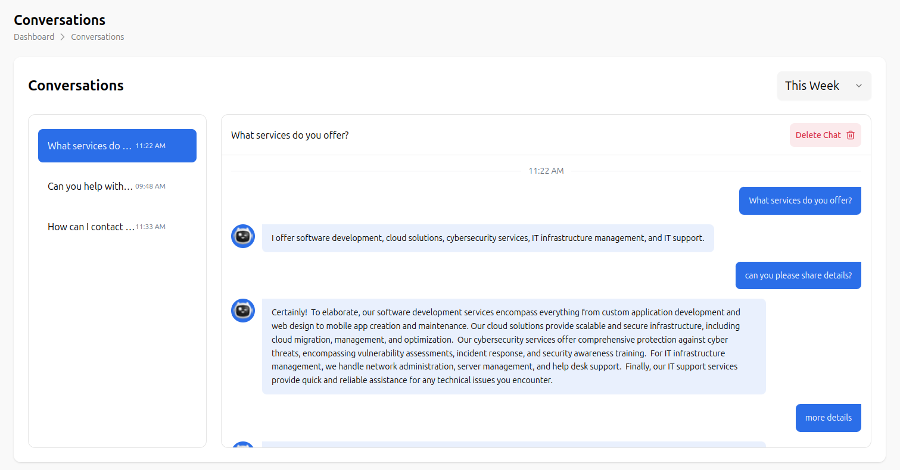
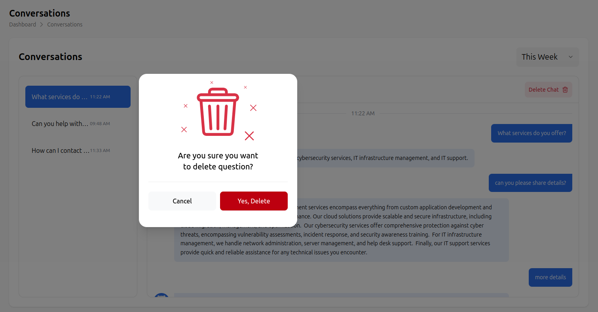
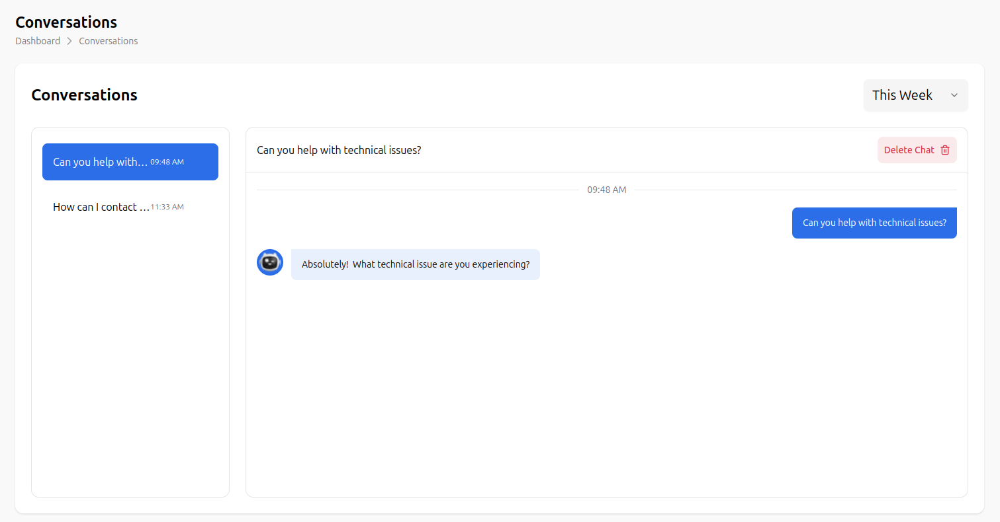

# Conversation Management System

The Conversation Management System provides a comprehensive interface for managing AI chat bot conversations, tracking user interactions, and maintaining conversation history. This feature enables administrators and users to monitor, organize, and manage chat interactions effectively.

## Overview

The Conversation Management System offers:

- **Conversation Tracking**: Monitor all chat interactions and user conversations
- **History Management**: Complete conversation history with timestamps
- **Conversation Organization**: Organize conversations by topics and time periods
- **Delete Management**: Safe conversation deletion with confirmation dialogs
- **Time-based Filtering**: Filter conversations by time periods (This Week, This Month, etc.)

## Main Interface

### Navigation Structure
```
Dashboard > Conversations
```

The interface features a clean, modern design with:
- **Header**: Displays "Conversations" title with breadcrumb navigation
- **Left Panel**: Conversation list with timestamps and previews
- **Right Panel**: Active conversation view with full chat history
- **Action Controls**: Delete, filter, and management options

## Conversation List (Left Panel)

### Conversation Items
Each conversation item displays:
- **Preview Text**: First few words of the conversation
- **Timestamp**: When the conversation occurred (e.g., "11:22 AM", "09:48 AM")
- **Active State**: Currently selected conversation is highlighted in blue
- **Quick Access**: Click any conversation to view full chat history

### Example Conversation List
```
What services do... 11:22 AM    [Active - Blue highlight]
Can you help with... 09:48 AM   [Inactive]
How can I contact... 11:33 AM  [Inactive]
```

## Active Conversation View (Right Panel)

### Conversation Header
- **Conversation Title**: Full question or topic (e.g., "What services do you offer?")
- **Time Filter**: Dropdown menu for filtering by time period ("This Week")
- **Delete Button**: Red "Delete Chat" button with trash can icon

### Chat Messages
The conversation view displays:
- **User Messages**: Blue chat bubbles on the right side
- **AI Responses**: Gray chat bubbles on the left side with robot avatar
- **Timestamps**: Time markers separating different conversation segments
- **Message Threading**: Clear visual separation between user and AI messages

### Message Types

#### User Messages
- **Appearance**: Blue chat bubbles aligned to the right
- **Content**: User questions and requests
- **Examples**: "What services do you offer?", "can you please share details?"

#### AI Responses
- **Appearance**: Gray chat bubbles aligned to the left
- **Avatar**: Small robot icon next to AI messages
- **Content**: Detailed responses based on knowledge base
- **Features**: "more details" buttons for expanded information

## Conversation Management Features

### Delete Conversation
1. **Access**: Click the red "Delete Chat" button in the conversation header
2. **Confirmation Dialog**: Modal appears asking "Are you sure you want to delete question?"
3. **Options**: 
   - "Cancel" (white button) - Keep the conversation
   - "Yes, Delete" (red button) - Permanently delete the conversation
4. **Safety**: Prevents accidental deletion with confirmation step

### Time-based Filtering
- **This Week**: Filter conversations from the current week
- **This Month**: View conversations from the current month
- **Custom Range**: Select specific date ranges for conversation history
- **Real-time Updates**: Filter updates immediately when changed

### Conversation Navigation
- **Quick Switch**: Click any conversation in the left panel to switch views
- **Active Indicator**: Currently selected conversation is highlighted
- **Seamless Transition**: Smooth switching between different conversations
- **Context Preservation**: Maintains conversation context when switching

## Advanced Features

### Conversation Analytics
- **Message Count**: Track number of messages per conversation
- **Response Time**: Monitor AI response times
- **User Engagement**: Analyze user interaction patterns
- **Topic Analysis**: Identify most common conversation topics

### Bulk Operations
- **Multi-Select**: Select multiple conversations for batch operations
- **Bulk Delete**: Delete multiple conversations at once
- **Bulk Export**: Export multiple conversations for analysis
- **Bulk Archive**: Archive old conversations to save space

### Search and Filter
- **Text Search**: Search conversations by content
- **Date Range**: Filter by specific date ranges
- **Topic Filter**: Filter by conversation topics
- **User Filter**: Filter by specific users
- **Status Filter**: Filter by conversation status

## Best Practices

### Conversation Organization
1. **Regular Cleanup**: Periodically delete old or irrelevant conversations
2. **Topic Categorization**: Use clear, descriptive conversation titles
3. **Time Management**: Use time filters to focus on recent conversations
4. **Quality Control**: Review AI responses for accuracy and helpfulness

### User Experience
1. **Quick Access**: Keep frequently accessed conversations easily available
2. **Clear Navigation**: Use descriptive conversation titles
3. **Efficient Management**: Use bulk operations for large conversation sets
4. **Regular Monitoring**: Check conversation quality and user satisfaction

## Technical Features

### Performance
- **Fast Loading**: Quick conversation switching and loading
- **Efficient Storage**: Optimized storage for conversation history
- **Real-time Updates**: Live updates for new conversations
- **Responsive Design**: Works across different screen sizes

### Data Management
- **Automatic Backup**: Conversations are automatically backed up
- **Data Retention**: Configurable retention policies for old conversations
- **Export Options**: Export conversations in multiple formats
- **Privacy Controls**: Secure handling of conversation data

## Integration with AI Chat Bot

The Conversation Management System works seamlessly with:

1. **Knowledge Base**: AI responses are based on uploaded knowledge content
2. **Analytics Dashboard**: Conversation data feeds into analytics
3. **User Management**: Links conversations to specific users
4. **Notification System**: Alerts for new conversations and responses

## Troubleshooting

### Common Issues
- **Slow Loading**: Check internet connection and server status
- **Missing Conversations**: Verify user permissions and access rights
- **Delete Failures**: Ensure proper permissions for deletion
- **Filter Issues**: Clear browser cache and refresh the page

### Support
For technical issues with conversation management:
- Check user permissions and access rights
- Verify system requirements and browser compatibility
- Contact support for advanced troubleshooting
- Review conversation management best practices

---

*This documentation covers the Conversation Management System as shown in the interface. The system provides a comprehensive solution for managing AI chat bot conversations through an intuitive, user-friendly interface.*

## Visual Examples

### Conversation Overview Interface


*The main conversation management interface showing the conversation list on the left and active chat on the right*

### Delete Conversation Process

#### Step 1: Delete Confirmation Dialog

*Confirmation dialog appears when user clicks "Delete Chat" button*

#### Step 2: After Deletion

*Interface after successful conversation deletion*

## Step-by-Step Visual Guide

### 1. Accessing Conversations
- Navigate to Dashboard > Conversations
- View the conversation list in the left panel
- See active conversation highlighted in blue

### 2. Viewing Conversation Details
- Click on any conversation in the left panel
- View full chat history in the right panel
- See user messages (blue) and AI responses (gray)

### 3. Deleting a Conversation
- Click the red "Delete Chat" button
- Confirm deletion in the modal dialog
- Conversation is removed from the list

### 4. Managing Multiple Conversations
- Switch between conversations using the left panel
- Use time filters to organize conversations
- Delete old or irrelevant conversations

