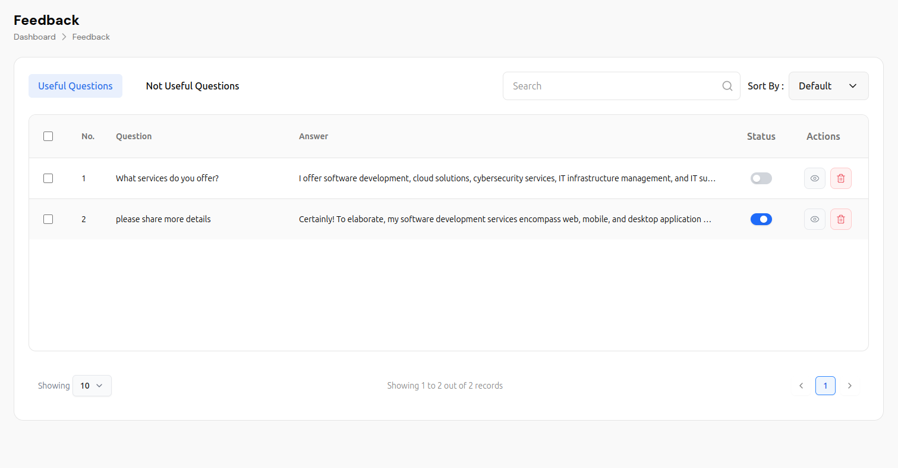
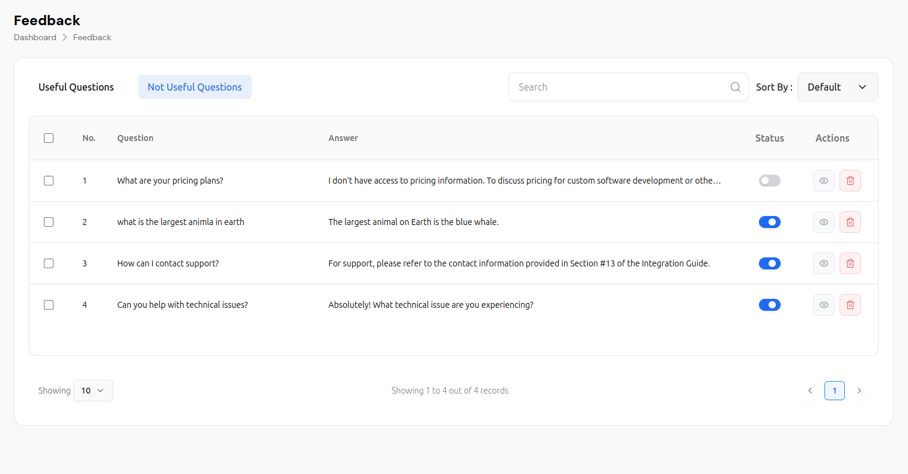
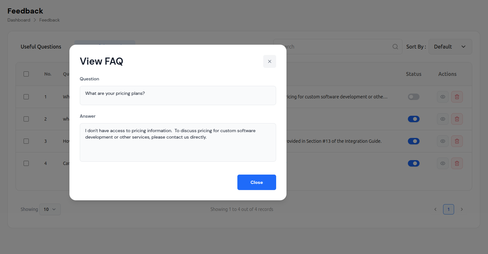
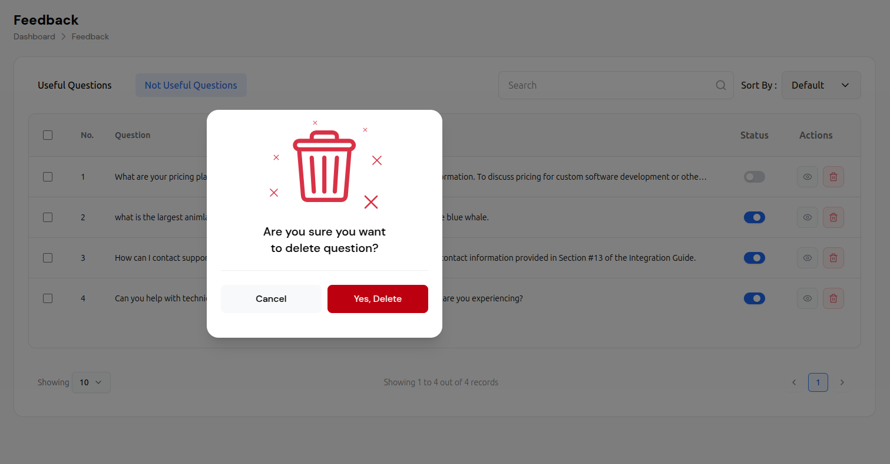
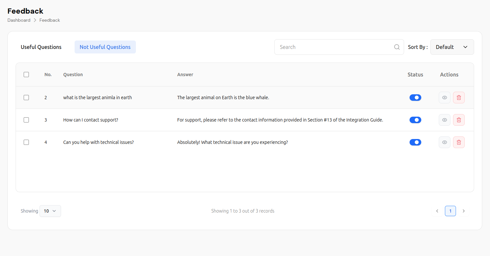

# Feedback Management System

The Feedback Management System provides comprehensive tools for managing user feedback, FAQ entries, and conversation quality. This system allows administrators to monitor, categorize, and improve AI chat bot responses based on user interactions and feedback.

## Overview

The Feedback Management System offers:

- **Question Categorization**: Organize questions into "Useful" and "Not Useful" categories
- **FAQ Management**: Create, edit, and manage frequently asked questions
- **Status Control**: Enable or disable questions with toggle switches
- **Search & Filter**: Advanced search and sorting capabilities
- **Bulk Operations**: Select and manage multiple questions at once
- **Analytics**: Track question performance and user satisfaction

## Main Interface

### Navigation Structure
```
Dashboard > Feedback
```

The interface features a clean, modern design with:
- **Header**: Displays "Feedback" title with breadcrumb navigation
- **Tab Navigation**: Two main categories (Useful Questions, Not Useful Questions)
- **Search & Filter**: Advanced search and sorting capabilities
- **Data Table**: Comprehensive question and answer management
- **Pagination**: Efficient navigation through large datasets

## Interface Components

### Header Section
- **Page Title**: "Feedback" prominently displayed
- **Breadcrumb Navigation**: "Dashboard > Feedback" showing current location
- **Clean Layout**: Modern, professional design with clear hierarchy

### Tab Navigation
The system provides two main categories:

#### Useful Questions Tab
- **Active Questions**: Questions that provide value to users
- **High-Quality Responses**: Well-answered questions with good feedback
- **Featured Content**: Questions that should be prioritized
- **Status Indicators**: Blue toggle switches indicate active questions

#### Not Useful Questions Tab
- **Low-Quality Questions**: Questions that don't provide value
- **Poor Responses**: Questions with inadequate or incorrect answers
- **Review Required**: Questions that need improvement
- **Status Indicators**: Gray toggle switches indicate inactive questions

### Search and Filter Controls

#### Search Functionality
- **Search Bar**: Text input with magnifying glass icon
- **Real-time Search**: Instant results as you type
- **Comprehensive Search**: Searches through questions and answers
- **Clear Results**: Easy to reset and start new searches

#### Sorting Options
- **Sort By Dropdown**: Multiple sorting criteria available
- **Default Sorting**: Chronological order by default
- **Custom Sorting**: Sort by relevance, date, status, etc.
- **Visual Indicators**: Clear dropdown with arrow indicators

## Data Table Features

### Table Structure
The main data table includes:

#### Column Headers
- **Checkbox**: Bulk selection for multiple operations
- **No.**: Sequential numbering for easy reference
- **Question**: The actual user question or query
- **Answer**: The AI's response to the question
- **Status**: Toggle switch for enabling/disabling questions
- **Actions**: View and delete operations

#### Row Data Examples
**Row 1: Pricing Information**
- Question: "What are your pricing plans?"
- Answer: "I don't have access to pricing information. To discuss pricing for custom software development or other services, please contact us directly."
- Status: Gray toggle (inactive)
- Actions: View and delete options

**Row 2: General Knowledge**
- Question: "what is the largest animla in earth"
- Answer: "The largest animal on Earth is the blue whale."
- Status: Blue toggle (active)
- Actions: View and delete options

**Row 3: Support Contact**
- Question: "How can I contact support?"
- Answer: "For support, please refer to the contact information provided in Section #13 of the Integration Guide."
- Status: Blue toggle (active)
- Actions: View and delete options

**Row 4: Technical Support**
- Question: "Can you help with technical issues?"
- Answer: "Absolutely! What technical issue are you experiencing?"
- Status: Blue toggle (active)
- Actions: View and delete options

## FAQ Management Features

### View FAQ Modal
The system includes a comprehensive FAQ viewing modal:

#### Modal Components
- **Title**: "View FAQ" prominently displayed
- **Close Button**: X icon in top-right corner
- **Question Field**: Read-only text input showing the question
- **Answer Field**: Text area displaying the full answer
- **Close Button**: Blue button to close the modal

#### Modal Functionality
- **Full Question Display**: Shows complete question text
- **Complete Answer**: Displays full answer without truncation
- **Easy Navigation**: Simple close functionality
- **Responsive Design**: Works on all device sizes

### Question Management

#### Status Control
- **Toggle Switches**: Easy enable/disable functionality
- **Visual Indicators**: Blue for active, gray for inactive
- **Instant Updates**: Changes apply immediately
- **Bulk Status Changes**: Select multiple questions for batch operations

#### Action Buttons
- **View Icon**: Eye icon for viewing full question details
- **Delete Icon**: Red trash can icon for deletion
- **Hover Effects**: Visual feedback on button interactions
- **Confirmation Required**: Delete operations require confirmation

## Advanced Features

### Bulk Operations
- **Multi-Select**: Checkbox selection for multiple questions
- **Bulk Actions**: Perform operations on multiple questions
- **Batch Status Changes**: Enable/disable multiple questions
- **Bulk Deletion**: Remove multiple questions at once

### Search and Filter
- **Text Search**: Search through questions and answers
- **Advanced Filters**: Filter by status, category, date
- **Sort Options**: Multiple sorting criteria
- **Quick Access**: Fast search and filter results

### Pagination
- **Records Per Page**: Configurable display (10, 25, 50, 100)
- **Page Navigation**: Previous/Next page controls
- **Record Count**: "Showing X to Y out of Z records"
- **Current Page**: Highlighted page number

## Delete Confirmation Process

### Delete Modal
When deleting a question, a confirmation modal appears:

#### Modal Design
- **Warning Icon**: Large red trash can icon
- **Confirmation Text**: "Are you sure you want to delete question?"
- **Action Buttons**: Cancel and Yes, Delete options
- **Visual Hierarchy**: Clear warning with distinct button styling

#### Button Styling
- **Cancel Button**: White background with gray border
- **Delete Button**: Red background with white text
- **Hover Effects**: Visual feedback on button interactions
- **Accessibility**: Clear contrast and readable text

## Best Practices

### Question Management
1. **Regular Review**: Periodically review all questions
2. **Quality Control**: Ensure answers are accurate and helpful
3. **Status Management**: Keep only relevant questions active
4. **Content Updates**: Update answers when information changes
5. **User Feedback**: Monitor user satisfaction with responses

### FAQ Optimization
1. **Clear Questions**: Use clear, specific question titles
2. **Comprehensive Answers**: Provide complete, helpful answers
3. **Regular Updates**: Keep FAQ content current and relevant
4. **Categorization**: Organize questions by topic and usefulness
5. **Performance Monitoring**: Track which questions are most effective

### System Maintenance
1. **Regular Cleanup**: Remove outdated or irrelevant questions
2. **Status Updates**: Keep question status current
3. **Bulk Operations**: Use bulk actions for efficiency
4. **Search Optimization**: Use clear, searchable question text
5. **Analytics Review**: Monitor question performance and user feedback

## Technical Features

### Performance
- **Fast Loading**: Quick table rendering and data display
- **Efficient Search**: Real-time search with minimal delay
- **Responsive Design**: Works across all device sizes
- **Optimized Queries**: Efficient database operations

### Data Management
- **Automatic Backup**: Questions and answers are backed up
- **Version Control**: Track changes to questions and answers
- **Export Options**: Export FAQ data in multiple formats
- **Import Capabilities**: Bulk import of questions and answers

### Security
- **Access Control**: Role-based permissions for different users
- **Data Validation**: Input validation for questions and answers
- **Audit Logging**: Track all changes and modifications
- **Secure Operations**: Safe deletion and modification processes

## Integration with AI Chat Bot

The Feedback Management System works seamlessly with:

1. **Knowledge Base**: Questions and answers feed into the AI knowledge base
2. **Response Quality**: Monitor and improve AI response quality
3. **User Satisfaction**: Track user feedback and satisfaction
4. **Continuous Improvement**: Use feedback to improve AI responses
5. **Analytics Dashboard**: Feed data into analytics and reporting

## Troubleshooting

### Common Issues
- **Search Not Working**: Check search terms and filters
- **Status Not Updating**: Verify permissions and refresh page
- **Modal Not Opening**: Check browser compatibility and JavaScript
- **Bulk Operations Failing**: Verify selection and permissions

### Solutions
1. **Refresh Interface**: Reload page to resolve temporary issues
2. **Check Permissions**: Verify user has proper access rights
3. **Clear Cache**: Clear browser cache and cookies
4. **Contact Support**: Contact support for persistent issues

---

*This documentation covers the comprehensive Feedback Management System. The system provides powerful tools for managing user feedback, FAQ entries, and conversation quality to improve your AI chat bot's performance.*

## Visual Examples

### Feedback Management Interface


*The main feedback interface showing "Useful Questions" tab with active questions*


*The "Not Useful Questions" tab showing questions that need review or improvement*

### View FAQ Modal


*Modal dialog showing detailed FAQ information with question and answer fields*

### Delete Confirmation Process

#### Delete Confirmation Dialog

*Confirmation modal that appears when deleting a feedback question*

#### Interface After Deletion

*The feedback interface after successfully deleting a question*

## Step-by-Step Visual Guide

### 1. Accessing Feedback Management
- Navigate to Dashboard > Feedback
- View the main feedback interface
- See both "Useful Questions" and "Not Useful Questions" tabs

### 2. Managing Useful Questions
- Click on "Useful Questions" tab
- View questions that provide value to users
- See active questions with blue toggle switches
- Use search and sort functionality

### 3. Reviewing Not Useful Questions
- Click on "Not Useful Questions" tab
- Review questions that don't provide value
- Identify questions that need improvement
- Plan content updates and improvements

### 4. Viewing FAQ Details
- Click the eye icon next to any question
- View the "View FAQ" modal
- See complete question and answer
- Close modal when finished

### 5. Deleting Questions
- Click the red trash can icon
- Confirm deletion in the modal dialog
- Question is removed from the list
- Interface updates immediately

