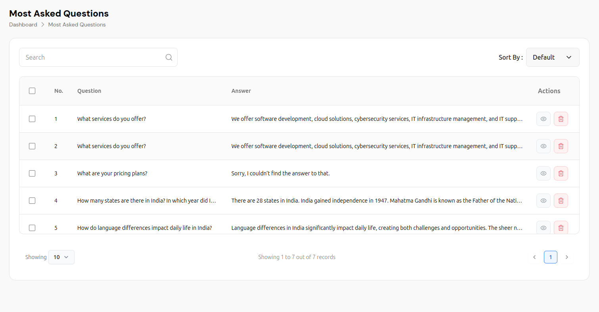
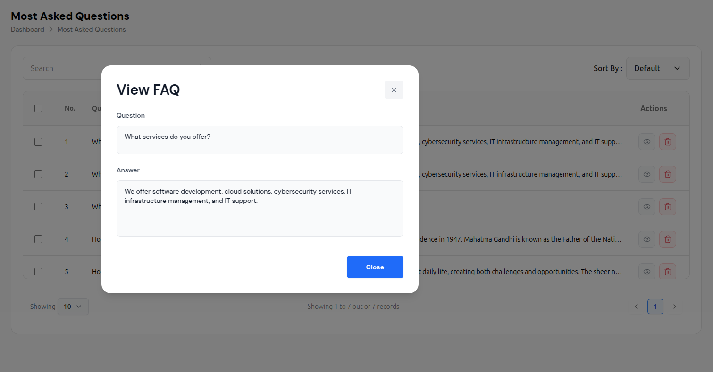
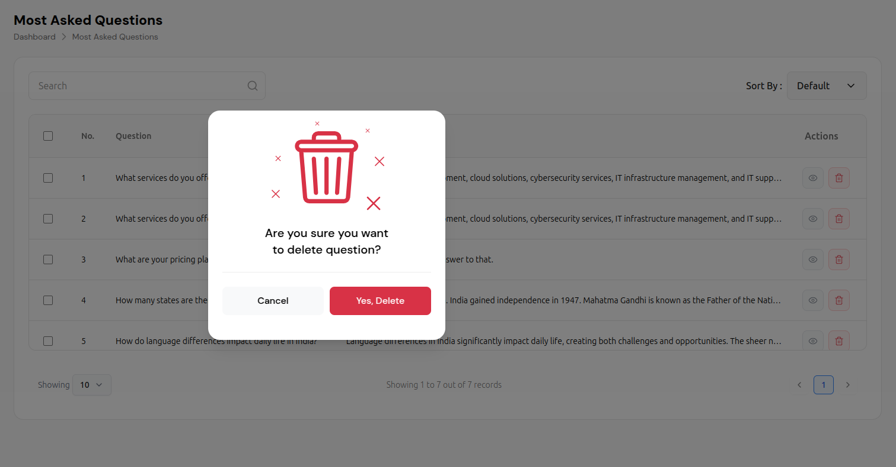

# Most Asked Questions Management

The Most Asked Questions (MAQ) system provides a comprehensive interface for managing frequently asked questions in your AI chat bot. This feature allows administrators to view, organize, and manage the most commonly asked questions to improve the chatbot's knowledge base and user experience.

## Overview

The Most Asked Questions system offers:

- **Question Analytics**: Track the most frequently asked questions
- **Answer Management**: View and manage answers to common questions
- **Search & Filter**: Advanced search and sorting capabilities
- **Bulk Operations**: Manage multiple questions simultaneously
- **Quality Control**: Review and improve question-answer pairs
- **Performance Tracking**: Monitor question effectiveness and user satisfaction

## Main Interface

### Navigation Structure
```
Dashboard > Most Asked Questions
```

The interface features a clean, modern design with:
- **Header**: Displays "Most Asked Questions" title with breadcrumb navigation
- **Search & Filter**: Advanced search and sorting capabilities
- **Data Table**: Comprehensive question and answer management
- **Pagination**: Efficient navigation through large datasets
- **Action Controls**: View and delete operations for each question

## Interface Components

### Header Section
- **Page Title**: "Most Asked Questions" prominently displayed
- **Breadcrumb Navigation**: "Dashboard > Most Asked Questions" showing current location
- **Clean Layout**: Modern, professional design with clear hierarchy

### Search and Filter Controls

#### Search Functionality
- **Search Bar**: Text input with magnifying glass icon
- **Real-time Search**: Instant results as you type
- **Comprehensive Search**: Searches through questions and answers
- **Clear Results**: Easy to reset and start new searches

#### Sorting Options
- **Sort By Dropdown**: Multiple sorting criteria available
- **Default Sorting**: Most frequently asked questions first
- **Custom Sorting**: Sort by relevance, date, popularity, etc.
- **Visual Indicators**: Clear dropdown with arrow indicators

## Data Table Features

### Table Structure
The main data table includes comprehensive question management:

#### Column Headers
- **Checkbox**: Bulk selection for multiple operations
- **No.**: Sequential numbering for easy reference
- **Question**: The actual user question or query
- **Answer**: The AI's response to the question
- **Actions**: View and delete operations

#### Sample Data Examples

**Row 1: Service Information**
- Question: "What services do you offer?"
- Answer: "We offer software development, cloud solutions, cybersecurity services, IT infrastructure management, and IT support."
- Actions: View and delete options

**Row 2: Pricing Information**
- Question: "What are your pricing plans?"
- Answer: "Sorry, I couldn't find the answer to that."
- Actions: View and delete options

**Row 3: General Knowledge**
- Question: "How many states are there in India? In which year did India get independence?"
- Answer: "There are 28 states in India. India gained independence in 1947. Mahatma Gandhi is known as the Father of the Nation."
- Actions: View and delete options

**Row 4: Cultural Information**
- Question: "How do language differences impact daily life in India?"
- Answer: "Language differences in India significantly impact daily life, creating both challenges and opportunities. The sheer number of languages..."
- Actions: View and delete options

## FAQ Viewing Modal

### Modal Interface
The "View FAQ" modal provides detailed question management:

#### Modal Components
- **Title**: "View FAQ" prominently displayed
- **Close Button**: X icon in top-right corner
- **Question Field**: Read-only text input showing the question
- **Answer Field**: Text area displaying the full answer
- **Close Button**: Blue button to close the modal

#### Modal Functionality
- **Full Question Display**: Shows complete question text
- **Complete Answer**: Displays full answer without truncation
- **Easy Navigation**: Simple close functionality
- **Responsive Design**: Works on all device sizes

## Delete Confirmation Process

### Delete Modal Design
When deleting a question, a confirmation modal appears:

#### Modal Components
- **Warning Icon**: Large red trash can icon
- **Confirmation Text**: "Are you sure you want to delete question?"
- **Action Buttons**: Cancel and Yes, Delete options
- **Visual Hierarchy**: Clear warning with distinct button styling

#### Button Styling
- **Cancel Button**: White background with gray border
- **Delete Button**: Red background with white text
- **Hover Effects**: Visual feedback on button interactions
- **Accessibility**: Clear contrast and readable text

## Advanced Features

### Bulk Operations
- **Multi-Select**: Checkbox selection for multiple questions
- **Bulk Actions**: Perform operations on multiple questions
- **Batch Status Changes**: Enable/disable multiple questions
- **Bulk Deletion**: Remove multiple questions at once

### Search and Filter
- **Text Search**: Search through questions and answers
- **Advanced Filters**: Filter by popularity, date, category
- **Sort Options**: Multiple sorting criteria
- **Quick Access**: Fast search and filter results

### Pagination
- **Records Per Page**: Configurable display (10, 25, 50, 100)
- **Page Navigation**: Previous/Next page controls
- **Record Count**: "Showing X to Y out of Z records"
- **Current Page**: Highlighted page number

## Question Analytics

### Popularity Tracking
- **Frequency Analysis**: Track how often questions are asked
- **Trend Monitoring**: Identify emerging question patterns
- **User Behavior**: Analyze user question preferences
- **Performance Metrics**: Measure question effectiveness

### Answer Quality
- **Response Accuracy**: Monitor answer quality and accuracy
- **User Satisfaction**: Track user satisfaction with answers
- **Gap Analysis**: Identify missing or inadequate answers
- **Improvement Opportunities**: Find areas for enhancement

## Best Practices

### Question Management
1. **Regular Review**: Periodically review all questions
2. **Quality Control**: Ensure answers are accurate and helpful
3. **Content Updates**: Update answers when information changes
4. **Performance Monitoring**: Track which questions are most effective
5. **User Feedback**: Monitor user satisfaction with responses

### Content Optimization
1. **Clear Questions**: Use specific, clear question titles
2. **Comprehensive Answers**: Provide complete, helpful answers
3. **Regular Updates**: Keep content current and relevant
4. **Categorization**: Organize questions by topic and popularity
5. **Search Optimization**: Use clear, searchable question text

### System Maintenance
1. **Regular Cleanup**: Remove outdated or irrelevant questions
2. **Bulk Operations**: Use bulk actions for efficiency
3. **Performance Monitoring**: Track system performance
4. **Analytics Review**: Monitor question performance and user feedback
5. **Continuous Improvement**: Use data to improve question quality

## Technical Features

### Performance
- **Fast Loading**: Quick table rendering and data display
- **Efficient Search**: Real-time search with minimal delay
- **Responsive Design**: Works across all device sizes
- **Optimized Queries**: Efficient database operations

### Data Management
- **Automatic Backup**: Questions and answers are backed up
- **Version Control**: Track changes to questions and answers
- **Export Options**: Export data in multiple formats
- **Import Capabilities**: Bulk import of questions and answers

### Security
- **Access Control**: Role-based permissions for different users
- **Data Validation**: Input validation for questions and answers
- **Audit Logging**: Track all changes and modifications
- **Secure Operations**: Safe deletion and modification processes

## Integration with AI Chat Bot

The Most Asked Questions system works seamlessly with:

1. **Knowledge Base**: Questions and answers feed into the AI knowledge base
2. **Response Quality**: Monitor and improve AI response quality
3. **User Satisfaction**: Track user feedback and satisfaction
4. **Continuous Improvement**: Use feedback to improve AI responses
5. **Analytics Dashboard**: Feed data into analytics and reporting

## Troubleshooting

### Common Issues
- **Search Not Working**: Check search terms and filters
- **Modal Not Opening**: Check browser compatibility and JavaScript
- **Bulk Operations Failing**: Verify selection and permissions
- **Performance Issues**: Check server performance and optimization

### Solutions
1. **Refresh Interface**: Reload page to resolve temporary issues
2. **Check Permissions**: Verify user has proper access rights
3. **Clear Cache**: Clear browser cache and cookies
4. **Contact Support**: Contact support for persistent issues

---

*This documentation covers the comprehensive Most Asked Questions management system. The system provides powerful tools for managing frequently asked questions to enhance your AI chat bot's knowledge base and improve user experience.*

## Visual Examples

### Main Interface

*The main Most Asked Questions interface showing the question list with search and sort functionality*

### View FAQ Modal

*Modal dialog for viewing complete FAQ details with question and answer fields*

### Delete Confirmation

*Confirmation modal that appears when attempting to delete a question*

## Step-by-Step Visual Guide

### 1. Accessing Most Asked Questions
- Navigate to Dashboard > Most Asked Questions
- View the main interface with question list
- Use search and sort functionality

### 2. Managing Questions
- Review questions and their answers
- Use search to find specific questions
- Sort questions by various criteria
- Use bulk operations for efficiency

### 3. Viewing Question Details
- Click the eye icon next to any question
- View the "View FAQ" modal
- See complete question and answer
- Close modal when finished

### 4. Deleting Questions
- Click the red trash can icon
- Confirm deletion in the modal dialog
- Question is removed from the list
- Interface updates immediately

### 5. Bulk Operations
- Use checkboxes to select multiple questions
- Perform bulk actions on selected questions
- Delete multiple questions at once
- Manage questions efficiently

