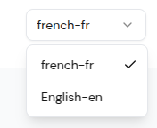

# Multi-Languages

eDemand provides comprehensive multi-language support with advanced language management capabilities for a more convenient and localized user experience.

## 🌍 Language Management Features

### Language Administration
- **Add New Languages**: Easily add new languages to your platform
- **Edit Language Settings**: Modify language names, codes, and display preferences
- **Remove Languages**: Safely remove unused languages from the system
- **Language Priority**: Set language priority and default language settings
- **Language Status**: Enable/disable languages for different user groups

### Translation Management
- **Auto-Translation**: Automatic translation of content using AI-powered translation services
- **Manual Translation**: Professional translation tools for accurate content localization
- **Translation Workflow**: Streamlined translation approval and review process
- **Translation Quality Control**: Monitor and improve translation accuracy
- **Bulk Translation**: Translate multiple content items simultaneously

### Language Configuration
- **Language Codes**: Configure ISO language codes and regional variants
- **RTL Support**: Right-to-left language support for Arabic, Hebrew, and other RTL languages
- **Character Encoding**: Proper character encoding for all supported languages
- **Font Support**: Custom font configuration for different language scripts
- **Date/Time Formats**: Localized date, time, and number formatting

## 🔧 Advanced Language Features

### Content Localization
- **Dynamic Content Translation**: Real-time translation of dynamic content
- **Static Content Management**: Manage static content translations
- **Image Localization**: Localized images and graphics for different regions
- **Video/Audio Localization**: Multi-language media content support
- **Document Translation**: Translate PDFs, documents, and downloadable content

### User Experience
- **Language Detection**: Automatic language detection based on user location/browser
- **Language Switching**: Easy language switching without page reload
- **Language Preferences**: User-specific language preference settings
- **Fallback Languages**: Automatic fallback to default language for missing translations
- **Language-Specific UI**: Customized user interface for different languages

### Translation Tools
- **Translation Editor**: Built-in translation editor with syntax highlighting
- **Translation Memory**: Reuse previous translations for consistency
- **Translation Glossary**: Maintain terminology consistency across languages
- **Translation Validation**: Automatic validation of translation completeness
- **Translation Export/Import**: Export and import translation files

## 📊 Language Analytics

### Usage Analytics
- **Language Usage Statistics**: Track which languages are most/least used
- **Regional Language Preferences**: Analyze language usage by geographic location
- **Language Adoption Rates**: Monitor how quickly new languages are adopted
- **User Language Switching**: Track users who switch between languages
- **Language-Specific Engagement**: Monitor engagement metrics by language

### Translation Analytics
- **Translation Progress**: Track translation completion status
- **Translation Quality Metrics**: Monitor translation accuracy and user feedback
- **Translation Performance**: Analyze translation speed and efficiency
- **Localization ROI**: Measure the impact of localization on user engagement
- **Cultural Adaptation Metrics**: Track how well content adapts to different cultures

## 🛠️ Language Management Tools

### Admin Panel Features
- **Language Dashboard**: Comprehensive overview of all language settings
- **Translation Management**: Centralized translation management interface
- **Language Settings**: Configure language-specific settings and preferences
- **User Language Assignment**: Assign specific languages to user groups
- **Language Testing**: Test language functionality and display

### Developer Tools
- **Language API**: API endpoints for language management
- **Translation API**: Programmatic access to translation services
- **Language Detection API**: Automatic language detection services
- **Localization API**: Content localization and formatting APIs
- **Language Webhooks**: Real-time language change notifications

## 📱 Mobile & Web Support

### Mobile App Features
- **Native Language Support**: Full native language support for mobile apps
- **Language-Specific App Store**: Different app store listings for different languages
- **Push Notification Localization**: Localized push notifications
- **In-App Language Switching**: Seamless language switching within the app
- **Offline Language Support**: Language support even when offline

### Web Platform Features
- **SEO Optimization**: Language-specific SEO optimization
- **URL Localization**: Localized URLs for different languages
- **Language-Specific Sitemaps**: Generate sitemaps for each language
- **Meta Tag Localization**: Localized meta tags and descriptions
- **Language-Specific Analytics**: Separate analytics tracking for each language

## 🔄 Language Workflow

### Translation Process
1. **Content Identification**: Identify content that needs translation
2. **Translation Assignment**: Assign translations to translators or AI services
3. **Translation Review**: Review and approve translations
4. **Quality Assurance**: Test translations in the live environment
5. **Publication**: Publish translated content to the platform

### Language Updates
- **Incremental Updates**: Update translations without affecting existing content
- **Version Control**: Track changes and versions of translations
- **Rollback Capability**: Rollback to previous translation versions if needed
- **A/B Testing**: Test different translations with user groups
- **Gradual Rollout**: Gradually roll out new translations to users

## 📈 Benefits

- **Global Reach**: Expand your platform to international markets
- **User Experience**: Provide native language experience for all users
- **Cultural Adaptation**: Adapt content to different cultural contexts
- **Market Penetration**: Enter new markets with localized content
- **Competitive Advantage**: Stand out with comprehensive language support

## 🎯 Use Cases

- **International Businesses**: Serve customers in their native languages
- **Local Service Providers**: Provide services in local languages
- **Global Marketplaces**: Support multiple languages for global reach
- **Educational Platforms**: Deliver content in multiple languages
- **Government Services**: Provide services in official languages

## 🔧 Technical Implementation

### Supported Languages
- **Major Languages**: English, Spanish, French, German, Italian, Portuguese, etc.
- **Asian Languages**: Chinese, Japanese, Korean, Hindi, Arabic, etc.
- **Regional Languages**: Support for regional and minority languages
- **RTL Languages**: Right-to-left language support
- **Custom Languages**: Add custom languages as needed

### Integration Options
- **Translation Services**: Integration with Google Translate, Microsoft Translator, etc.
- **Professional Translation**: Integration with professional translation services
- **Crowdsourced Translation**: Community-based translation options
- **AI Translation**: Advanced AI-powered translation capabilities
- **Hybrid Approach**: Combine automatic and manual translation methods

