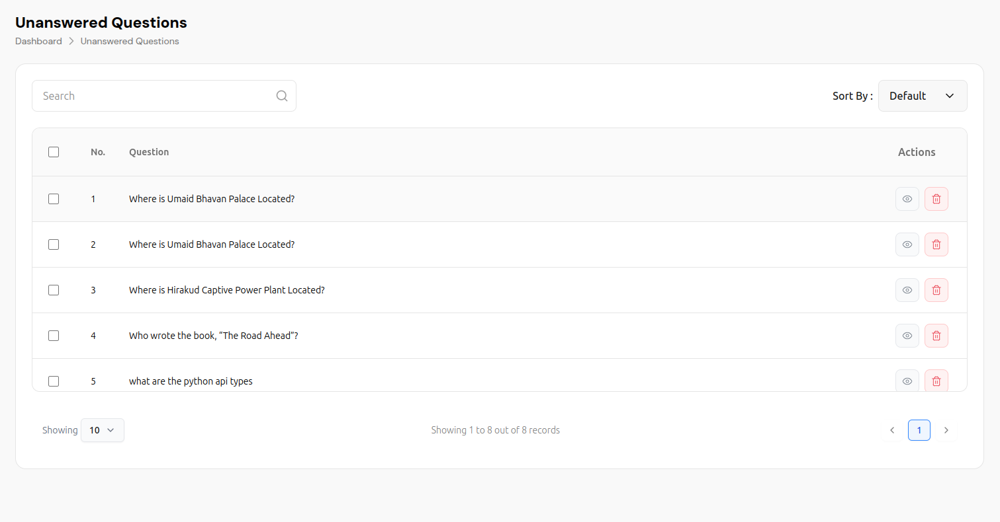
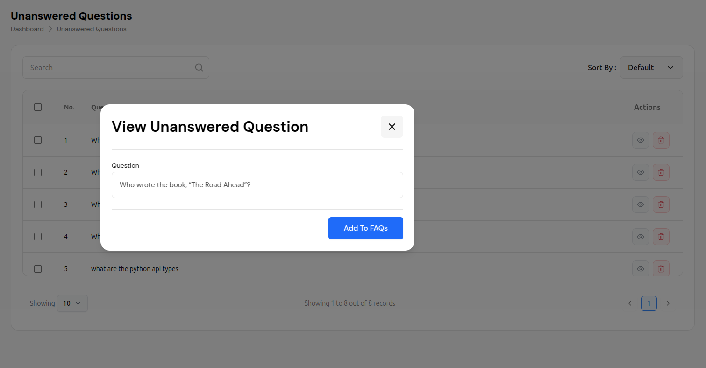
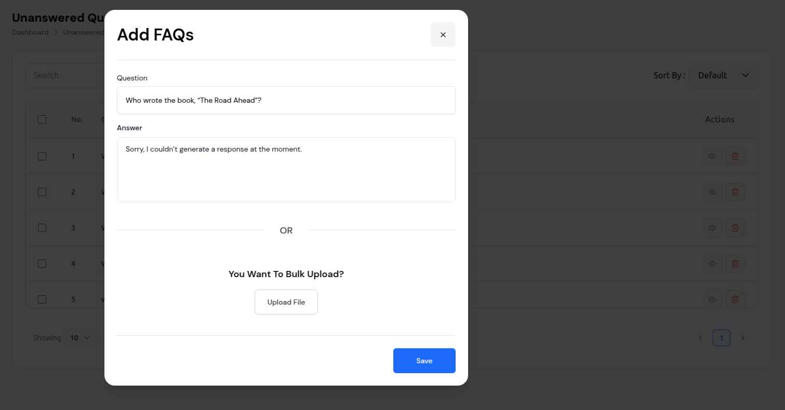
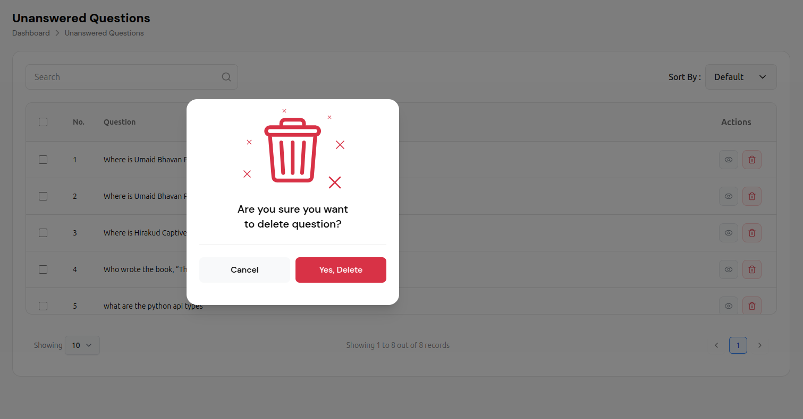
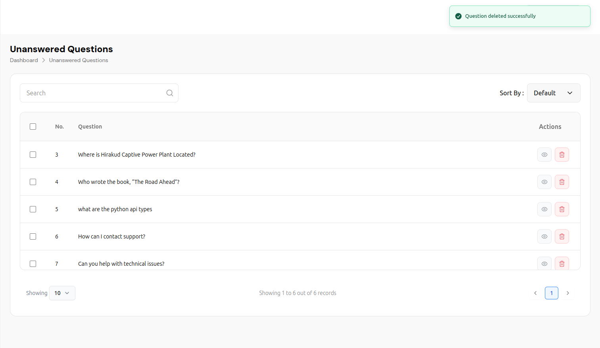

# Unanswered Questions Management

The Unanswered Questions system provides a comprehensive interface for managing questions that the AI chat bot has not yet been able to answer. This feature allows administrators to review, categorize, and convert unanswered questions into FAQs to improve the chatbot's knowledge base.

## Overview

The Unanswered Questions system offers:

- **Question Tracking**: Monitor questions that the AI couldn't answer
- **FAQ Conversion**: Convert unanswered questions into FAQs
- **Search & Filter**: Advanced search and sorting capabilities
- **Bulk Operations**: Manage multiple questions simultaneously
- **Quality Control**: Review and improve question handling
- **Performance Tracking**: Monitor question resolution rates

## Main Interface

### Navigation Structure
```
Dashboard > Unanswered Questions
```

The interface features a clean, modern design with:
- **Header**: Displays "Unanswered Questions" title with breadcrumb navigation
- **Search & Filter**: Advanced search and sorting capabilities
- **Data Table**: Comprehensive question management
- **Pagination**: Efficient navigation through large datasets
- **Action Controls**: View, convert, and delete operations

## Interface Components

### Header Section
- **Page Title**: "Unanswered Questions" prominently displayed
- **Breadcrumb Navigation**: "Dashboard > Unanswered Questions" showing current location
- **Success Messages**: Green success banners for completed actions
- **Clean Layout**: Modern, professional design with clear hierarchy

### Search and Filter Controls

#### Search Functionality
- **Search Bar**: Text input with magnifying glass icon
- **Real-time Search**: Instant results as you type
- **Comprehensive Search**: Searches through question text
- **Clear Results**: Easy to reset and start new searches

#### Sorting Options
- **Sort By Dropdown**: Multiple sorting criteria available
- **Default Sorting**: Chronological order by default
- **Custom Sorting**: Sort by relevance, date, priority, etc.
- **Visual Indicators**: Clear dropdown with arrow indicators

## Data Table Features

### Table Structure
The main data table includes comprehensive question management:

#### Column Headers
- **Checkbox**: Bulk selection for multiple operations
- **No.**: Sequential numbering for easy reference
- **Question**: The actual unanswered question text
- **Actions**: View, convert, and delete operations

#### Sample Questions

**Question 1: Location Information**
- Question: "Where is Umaid Bhavan Palace Located?"
- Actions: View and delete options

**Question 2: Location Information (Duplicate)**
- Question: "Where is Umaid Bhavan Palace Located?"
- Actions: View and delete options

**Question 3: Industrial Information**
- Question: "Where is Hirakud Captive Power Plant Located?"
- Actions: View and delete options

**Question 4: Literature Information**
- Question: "Who wrote the book, "The Road Ahead"?"
- Actions: View and delete options

**Question 5: Technical Information**
- Question: "what are the python api types"
- Actions: View and delete options

**Question 6: Support Information**
- Question: "How can I contact support?"
- Actions: View and delete options

**Question 7: Technical Support**
- Question: "Can you help with technical issues?"
- Actions: View and delete options

## View Question Modal

### Modal Interface
The "View Unanswered Question" modal provides detailed question management:

#### Modal Components
- **Title**: "View Unanswered Question" prominently displayed
- **Close Button**: X icon in top-right corner
- **Question Field**: Read-only text input showing the question
- **Add to FAQs Button**: Blue button to convert question to FAQ

#### Modal Functionality
- **Full Question Display**: Shows complete question text
- **FAQ Conversion**: Convert unanswered question to FAQ
- **Easy Navigation**: Simple close functionality
- **Responsive Design**: Works on all device sizes

## Add FAQs Modal

### Modal Interface
The "Add FAQs" modal provides comprehensive FAQ creation:

#### Modal Components
- **Title**: "Add FAQs" prominently displayed
- **Close Button**: X icon in top-right corner
- **Question Field**: Text input for question text
- **Answer Field**: Text area for answer content
- **Bulk Upload Option**: File upload for bulk FAQ creation
- **Save Button**: Blue button to save FAQ

#### Modal Functionality
- **Manual Entry**: Create individual FAQs with question and answer
- **Bulk Upload**: Upload multiple FAQs via file
- **Flexible Input**: Support for various question types
- **Easy Management**: Simple save and close functionality

## Delete Confirmation Process

### Delete Modal Design
When deleting a question, a confirmation modal appears:

#### Modal Components
- **Warning Icon**: Large red trash can icon
- **Confirmation Text**: "Are you sure you want to delete question?"
- **Action Buttons**: Cancel and Yes, Delete options
- **Visual Hierarchy**: Clear warning with distinct button styling

#### Button Styling
- **Cancel Button**: White background with gray border
- **Delete Button**: Red background with white text
- **Hover Effects**: Visual feedback on button interactions
- **Accessibility**: Clear contrast and readable text

## Advanced Features

### Bulk Operations
- **Multi-Select**: Checkbox selection for multiple questions
- **Bulk Actions**: Perform operations on multiple questions
- **Batch Conversion**: Convert multiple questions to FAQs
- **Bulk Deletion**: Remove multiple questions at once

### Search and Filter
- **Text Search**: Search through question text
- **Advanced Filters**: Filter by date, category, priority
- **Sort Options**: Multiple sorting criteria
- **Quick Access**: Fast search and filter results

### Pagination
- **Records Per Page**: Configurable display (10, 25, 50, 100)
- **Page Navigation**: Previous/Next page controls
- **Record Count**: "Showing X to Y out of Z records"
- **Current Page**: Highlighted page number

## FAQ Conversion Process

### Convert to FAQ
1. **Click** the eye icon next to any question
2. **Review** the "View Unanswered Question" modal
3. **Click** "Add To FAQs" button
4. **Fill** in the answer in the "Add FAQs" modal
5. **Save** the FAQ entry

### Manual FAQ Creation
1. **Click** "Add FAQs" button
2. **Enter** question text in the question field
3. **Enter** answer text in the answer field
4. **Click** "Save" to create the FAQ

### Bulk FAQ Upload
1. **Click** "Add FAQs" button
2. **Click** "Upload File" for bulk upload
3. **Select** file with FAQ data
4. **Upload** and process the file

## Best Practices

### Question Management
1. **Regular Review**: Periodically review all unanswered questions
2. **Quality Control**: Ensure questions are properly categorized
3. **FAQ Conversion**: Convert valuable questions to FAQs
4. **Content Updates**: Update knowledge base based on unanswered questions
5. **Performance Monitoring**: Track question resolution rates

### FAQ Creation
1. **Clear Questions**: Use specific, clear question titles
2. **Comprehensive Answers**: Provide complete, helpful answers
3. **Regular Updates**: Keep FAQ content current and relevant
4. **Categorization**: Organize questions by topic and priority
5. **Quality Control**: Review and improve FAQ content

### System Maintenance
1. **Regular Cleanup**: Remove irrelevant or duplicate questions
2. **Bulk Operations**: Use bulk actions for efficiency
3. **Performance Monitoring**: Track system performance
4. **Analytics Review**: Monitor question patterns and trends
5. **Continuous Improvement**: Use data to improve question handling

## Technical Features

### Performance
- **Fast Loading**: Quick table rendering and data display
- **Efficient Search**: Real-time search with minimal delay
- **Responsive Design**: Works across all device sizes
- **Optimized Queries**: Efficient database operations

### Data Management
- **Automatic Backup**: Questions are automatically backed up
- **Version Control**: Track changes to questions and FAQs
- **Export Options**: Export data in multiple formats
- **Import Capabilities**: Bulk import of questions and FAQs

### Security
- **Access Control**: Role-based permissions for different users
- **Data Validation**: Input validation for questions and answers
- **Audit Logging**: Track all changes and modifications
- **Secure Operations**: Safe deletion and modification processes

## Integration with AI Chat Bot

The Unanswered Questions system works seamlessly with:

1. **Knowledge Base**: Convert unanswered questions to FAQs
2. **Response Quality**: Monitor and improve AI response quality
3. **User Satisfaction**: Track user feedback and satisfaction
4. **Continuous Improvement**: Use feedback to improve AI responses
5. **Analytics Dashboard**: Feed data into analytics and reporting

## Troubleshooting

### Common Issues
- **Search Not Working**: Check search terms and filters
- **Modal Not Opening**: Check browser compatibility and JavaScript
- **Bulk Operations Failing**: Verify selection and permissions
- **FAQ Conversion Issues**: Check permissions and data validation

### Solutions
1. **Refresh Interface**: Reload page to resolve temporary issues
2. **Check Permissions**: Verify user has proper access rights
3. **Clear Cache**: Clear browser cache and cookies
4. **Contact Support**: Contact support for persistent issues

---

*This documentation covers the comprehensive Unanswered Questions management system. The system provides powerful tools for managing unanswered questions and converting them to FAQs to enhance your AI chat bot's knowledge base.*

## Visual Examples

### Main Interface

*The main Unanswered Questions interface showing the question list with search and sort functionality*

### View Question Modal

*Modal dialog for viewing unanswered question details with option to add to FAQs*

### Add FAQs Modal

*Modal dialog for creating new FAQs with manual entry and bulk upload options*

### Delete Confirmation

*Confirmation modal that appears when attempting to delete an unanswered question*

### Interface After Deletion

*The interface after successfully deleting an unanswered question with success message*

## Step-by-Step Visual Guide

### 1. Accessing Unanswered Questions
- Navigate to Dashboard > Unanswered Questions
- View the main interface with question list
- Use search and sort functionality

### 2. Managing Questions
- Review unanswered questions and their content
- Use search to find specific questions
- Sort questions by various criteria
- Use bulk operations for efficiency

### 3. Viewing Question Details
- Click the eye icon next to any question
- View the "View Unanswered Question" modal
- See complete question text
- Use "Add To FAQs" button to convert

### 4. Creating FAQs
- Click "Add To FAQs" or "Add FAQs" button
- Fill in question and answer fields
- Use bulk upload for multiple FAQs
- Save the FAQ entry

### 5. Deleting Questions
- Click the red trash can icon
- Confirm deletion in the modal dialog
- Question is removed from the list
- Success message appears


## Visual Examples

### Main Interface

*The main Unanswered Questions interface showing the question list with search and sort functionality*

### View Question Modal

*Modal dialog for viewing unanswered question details with option to add to FAQs*

### Add FAQs Modal

*Modal dialog for creating new FAQs with manual entry and bulk upload options*

### Delete Confirmation

*Confirmation modal that appears when attempting to delete an unanswered question*

### Interface After Deletion

*The interface after successfully deleting an unanswered question with success message*

## Step-by-Step Visual Guide

### 1. Accessing Unanswered Questions
- Navigate to Dashboard > Unanswered Questions
- View the main interface with question list
- Use search and sort functionality

### 2. Managing Questions
- Review unanswered questions and their content
- Use search to find specific questions
- Sort questions by various criteria
- Use bulk operations for efficiency

### 3. Viewing Question Details
- Click the eye icon next to any question
- View the "View Unanswered Question" modal
- See complete question text
- Use "Add To FAQs" button to convert

### 4. Creating FAQs
- Click "Add To FAQs" or "Add FAQs" button
- Fill in question and answer fields
- Use bulk upload for multiple FAQs
- Save the FAQ entry

### 5. Deleting Questions
- Click the red trash can icon
- Confirm deletion in the modal dialog
- Question is removed from the list
- Success message appears

