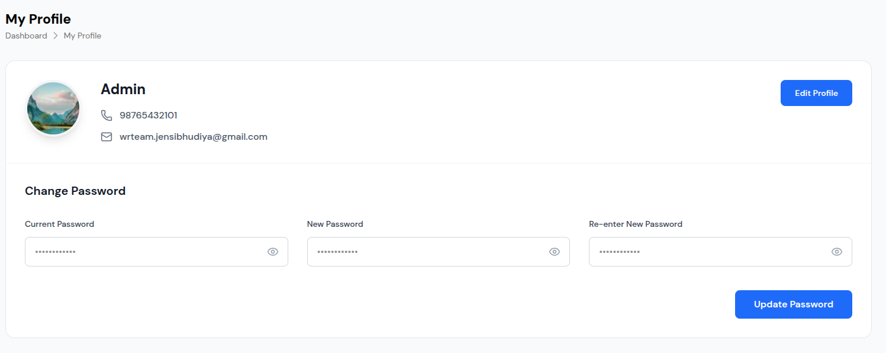
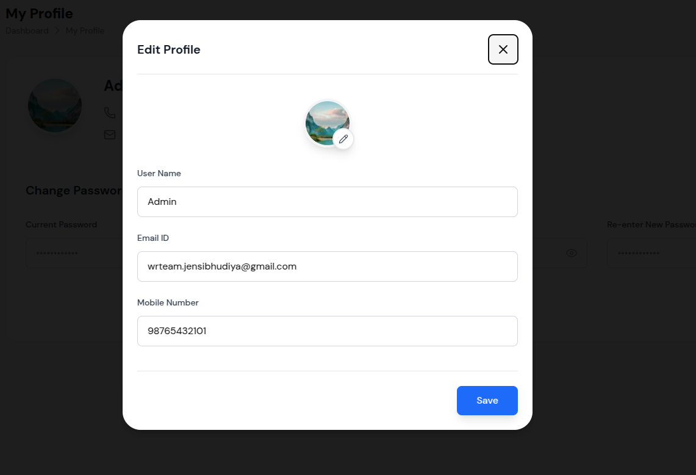

# User Profile Management - Visual Guide

This visual guide provides step-by-step instructions for managing user profiles using the User Profile Management interface. Follow these visual examples to effectively manage your profile information and password settings.

## Overview

The User Profile Management system provides comprehensive profile management capabilities. This visual guide covers all major operations including profile viewing, editing, and password management.

## Main Profile Interface

### Profile Dashboard

*The main User Profile interface showing profile information and password management sections*

**Key Elements:**
- **Header**: "My Profile" title with breadcrumb navigation
- **Profile Section**: User information display and editing
- **Password Section**: Secure password change functionality
- **Action Controls**: Edit profile and update password operations

## Profile Information Management

### Step 1: Access Profile

*Navigate to Dashboard > My Profile to access profile management*

### Step 2: View Profile Information
**Profile Display Elements:**
- **Profile Picture**: Circular profile image with landscape background
- **User Name**: "Admin" displayed in large, bold font
- **Phone Number**: Phone icon with "98765432101"
- **Email Address**: Envelope icon with "wrteam.jensibhudiya@gmail.com"
- **Edit Button**: Blue "Edit Profile" button for modifications

### Step 3: Edit Profile Information

*Click "Edit Profile" to open the editing modal*

**Edit Profile Modal Features:**
- **Modal Header**: "Edit Profile" title with close button (X)
- **Profile Picture**: Circular profile image with edit pencil icon
- **Input Fields**: User name, email, and mobile number fields
- **Action Button**: Blue "Save" button for profile updates

### Step 4: Update Profile Details
1. **Click Edit Profile**: Click the blue "Edit Profile" button
2. **Modify Information**: Update user name, email, or mobile number
3. **Change Profile Picture**: Click profile image to upload new image
4. **Save Changes**: Click "Save" to update profile information

## Password Management

### Step 1: Access Password Section

*View the "Change Password" section with password fields*

### Step 2: Change Password Process
**Password Fields:**
- **Current Password**: Masked input field with eye icon for visibility toggle
- **New Password**: Masked input field with eye icon for visibility toggle
- **Re-enter New Password**: Confirmation field with eye icon for visibility toggle

### Step 3: Update Password
1. **Enter Current Password**: Provide current password for verification
2. **Enter New Password**: Create new secure password
3. **Confirm New Password**: Re-enter new password for confirmation
4. **Update Password**: Click "Update Password" to save changes

## Profile Picture Management

### Step 1: Access Profile Picture

*Click on profile picture to edit in the edit modal*

### Step 2: Change Profile Picture
1. **Click Profile Image**: Click on profile picture to edit
2. **Upload New Image**: Select new image file
3. **Preview Image**: Review selected image before saving
4. **Save Changes**: Confirm new profile picture

## Best Practices

### Profile Management
1. **Regular Updates**: Keep profile information current
2. **Secure Information**: Protect sensitive personal data
3. **Profile Picture**: Use appropriate, professional images
4. **Contact Information**: Ensure accurate contact details
5. **Privacy Settings**: Configure appropriate privacy levels

### Password Security
1. **Strong Passwords**: Use complex, unique passwords
2. **Regular Updates**: Change passwords periodically
3. **Password History**: Avoid reusing recent passwords
4. **Security Questions**: Set up security questions
5. **Two-Factor Authentication**: Enable 2FA when available

### Data Protection
1. **Secure Storage**: Ensure data is encrypted at rest
2. **Transmission Security**: Use HTTPS for all communications
3. **Access Control**: Implement proper access controls
4. **Audit Logging**: Track profile and password changes
5. **Backup Systems**: Regular backup of user data

## Troubleshooting

### Common Issues
- **Profile Not Loading**: Check user permissions and access
- **Password Not Updating**: Verify current password and requirements
- **Image Upload Issues**: Check file format and size limits
- **Contact Information**: Verify email and phone number formats

### Visual Indicators
- **Success Messages**: Green notifications for successful operations
- **Error Messages**: Red text for validation errors
- **Loading States**: Spinner indicators for processing
- **Field Validation**: Real-time validation feedback
- **Password Strength**: Visual indicators for password strength

## Technical Notes

### Image Requirements
- **Format**: JPEG, PNG, or GIF format for profile pictures
- **Size**: Reasonable file size limits for uploads
- **Dimensions**: Square aspect ratio recommended
- **Quality**: High-quality images for best display
- **Backup**: Regular backup of profile images

### Performance Considerations
- **Fast Loading**: Quick profile rendering and updates
- **Real-time Updates**: Live profile information updates
- **Responsive Design**: Works across all device sizes
- **Efficient Operations**: Quick profile management operations

---

*This visual guide provides comprehensive coverage of the User Profile Management system. Use these visual examples to effectively manage your profile information and maintain security best practices.*

